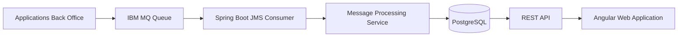

# Payment Messages


---

## Description

**Payment Messages** est une application web permettant de collecter, stocker et consulter des messages de paiement transitant via une infrastructure **IBM MQ Series**.

L'application simule un contexte bancaire où plusieurs applications Back Office déposent des messages financiers dans une file MQ. Ces messages sont ensuite :

- consommés automatiquement depuis IBM MQ ;
- persistés dans une base relationnelle PostgreSQL ;
- exposés via des API REST ;
- consultables depuis une interface Angular.

L'objectif est de proposer une solution robuste répondant aux contraintes d'un environnement bancaire :

- forte volumétrie ;
- performance ;
- résilience ;
- traçabilité ;
- supervision des traitements.

---

# Architecture



---

# Stack technique

## Backend

| Technologie | Version |
|---|---|
| Java | 21 |
| Spring Boot | 4.1.0 |
| Spring Data JPA | - |
| Spring JMS | - |
| IBM MQ Client | 9.4.2.0 |
| PostgreSQL | 18 |
| Maven | - |


## Frontend

| Technologie | Version |
|---|---|
| Angular | 22 |
| TypeScript | - |


## Infrastructure

| Technologie |
|-|
| Docker |
| Docker Compose |

---

# Structure du projet

```text
payment-messages
│
├── backend
│   ├── src
│   ├── pom.xml
│   └── Dockerfile
│
├── frontend
│   ├── src
│   └── Dockerfile
│
├── docs
│   
│
├── docker
│
├── docker-compose.yml
│
└── README.md
```

---

# Fonctionnalités

## Backend

✅ Consommation des messages IBM MQ    
✅ API REST de consultation  


## Frontend

✅ Dashboard des messages  
✅ Recherche et filtrage  
✅ Consultation du détail d'un message  
 


---

# Prérequis

Avant de démarrer :


---

# Configuration


---

# Lancement avec Docker Compose

Depuis la racine du projet :

```bash
docker compose up -d
```

Services démarrés :

| Service | Port |
|-|-|
| Backend Spring Boot | 8080 |
| PostgreSQL | 5432 |
| Angular | 4200 |
| IBM MQ | 1414 |

---

# Lancement Backend

```bash
cd backend

./mvnw spring-boot:run
```

ou :

```bash
mvn spring-boot:run
```

---

# Lancement Frontend

```bash
cd frontend

npm install

ng serve
```

Application disponible :

```
http://localhost:4200
```

---

# API REST

Documentation OpenAPI disponible :

```
http://localhost:8080/swagger-ui.html
```


---

# Tests

Backend :

```bash
cd backend

mvn test
```

Tests couverts :


---

# Observabilité


---

# Documentation

Documentation technique disponible dans :

```
/docs
```

Contenu :

- Architecture globale
- Architecture backend
- Flux de données
- Choix techniques


---