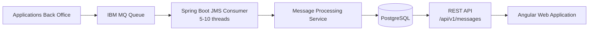

# Payment Messages


---

## Description

**Payment Messages** est une application web permettant de collecter, stocker et consulter des messages de paiement transitant via une infrastructure **IBM MQ Series**.

L'application simule un contexte bancaire où plusieurs applications Back Office déposent des messages financiers dans une file MQ. Ces messages sont ensuite :

- consommés automatiquement depuis IBM MQ (5-10 threads concurrents) ;
- persistés dans une base relationnelle PostgreSQL ;
- exposés via une API REST paginée avec filtres ;
- consultables et gérables depuis une interface Angular.

L'objectif est de proposer une solution robuste répondant aux contraintes d'un environnement bancaire :

- forte volumétrie ;
- performance ;
- résilience (retry, reprise sur erreur) ;
- traçabilité (cycle de vie complet des messages) ;
- supervision des traitements.

---

## Architecture



Documentation détaillée dans [docs/architecture/](docs/architecture/) :

- [Architecture globale](docs/architecture/architecture-globale.md)
- [Architecture backend](docs/architecture/architecture-backend.md)
- [Architecture frontend](docs/architecture/architecture-frontend.md)
- [Flux de données](docs/architecture/flux.md)

---

## Stack technique

### Backend

| Technologie | Version |
|---|---|
| Java | 21 |
| Spring Boot | 4.1.0 |
| Spring Data JPA | - |
| Spring JMS | - |
| IBM MQ Client | 9.4.2.0 |
| PostgreSQL | 18 |
| H2 (tests) | - |
| Lombok | - |
| SpringDoc OpenAPI | 2.8.9 |
| Spring Boot Actuator | - |

### Frontend

| Technologie | Version |
|---|---|
| Angular | 22 (standalone) |
| TypeScript | 6 |
| RxJS | 7.8 |
| Vitest | 4 |

### Infrastructure

| Technologie | Rôle |
|---|---|
| Docker | Conteneurisation |
| Docker Compose | Orchestration locale |

---

## Fonctionnalités

### Backend

- ✅ Consommation des messages IBM MQ (JMS Listener)
- ✅ Persistance en base PostgreSQL
- ✅ API REST paginée avec filtres (statut, date)
- ✅ Consultation individuelle des messages
- ✅ Statistiques par statut
- ✅ Suppression de messages
- ✅ Retry individuel et batch des messages en échec
- ✅ Mise à jour du statut des messages
- ✅ Documentation Swagger UI (OpenAPI)
- ✅ Gestion centralisée des erreurs
- ✅ Métriques et santé (Actuator)
- ✅ Cycle de vie à 8 statuts (RECEIVED → DEAD_LETTER)

### Frontend

- ✅ Scaffold Angular 22 standalone
- ❌ Dashboard (liste + filtres) — à implémenter
- ❌ Recherche et filtrage — à implémenter
- ❌ Consultation du détail — à implémenter

---

## Structure du projet

```
payment-messages
├── backend/
│   ├── src/main/java/com/bank/paymentmessages/
│   │   ├── config/          # Configuration Jackson
│   │   ├── controller/      # REST Controller
│   │   ├── dto/             # DTOs API et MQ
│   │   ├── entity/          # Entité JPA + Enum
│   │   ├── exception/       # Gestion des erreurs
│   │   ├── mapper/          # Mapping Entity ↔ DTO
│   │   ├── mq/              # JMS Listener
│   │   ├── repository/      # Spring Data JPA
│   │   └── service/         # Logique métier
│   ├── src/main/resources/
│   │   ├── application.yaml
│   │   ├── application-dev.yaml
│   │   └── application-dev.example.yaml
│   ├── src/test/            # Tests unitaires
│   ├── pom.xml
│   └── Dockerfile
├── frontend/
│   └── src/app/             # Angular standalone
├── docs/
│   ├── api/                 # Documentation API REST
│   ├── architecture/        # Documentation architecture
│   ├── database/            # Modèle de données
│   └── ibm-mq/              # Configuration IBM MQ
├── docker-compose.yaml
└── README.md
```

---

## Prérequis

- **Java 21** (JDK Temurin recommandé)
- **Node.js 22**
- **Docker** et **Docker Compose**
- **Maven** (ou utiliser `./mvnw`)

---

## Configuration

### Backend

Copier et éditer le fichier d'exemple :

```bash
cp backend/src/main/resources/application-dev.example.yaml \
   backend/src/main/resources/application-dev.yaml
```

Variables d'environnement requises (ou définies dans `application-dev.yaml`) :

| Variable | Description |
|---|---|
| `DB_URL` | `jdbc:postgresql://localhost:5432/payment_messages` |
| `DB_USER` | `payment` |
| `DB_PASSWORD` | `payment` |
| `MQ_CONN_NAME` | `localhost(1414)` |
| `MQ_QUEUE` | `PAYMENT.REQUEST.QUEUE` |

### IBM MQ

Documentation détaillée : [docs/ibm-mq/ibm-mq-configuration.md](docs/ibm-mq/ibm-mq-configuration.md)

---

## Lancement avec Docker Compose

```bash
docker compose up -d
```

| Service | Port | Image |
|---|---|---|
| PostgreSQL | 5432 | postgres:18 |
| pgAdmin | 5050 | dpage/pgadmin4 |
| IBM MQ | 1414, 9443 | icr.io/ibm-messaging/mq |
| Backend Spring Boot | 8080 | build local |
| Frontend Angular | 4200 | build local |

---

## Lancement Backend (dev)

```bash
cd backend
./mvnw spring-boot:run
```

---

## Lancement Frontend (dev)

```bash
cd frontend
npm install
ng serve
```

Application disponible : `http://localhost:4200`

---

## API REST

Base path : `/api/v1/messages`

| Méthode | Path | Description |
|---|---|---|
| `GET` | `/api/v1/messages` | Liste paginée (filtres : status, receivedAfter) |
| `GET` | `/api/v1/messages/stats` | Statistiques par statut |
| `GET` | `/api/v1/messages/{id}` | Détail d'un message |
| `DELETE` | `/api/v1/messages/{id}` | Suppression (204) |
| `POST` | `/api/v1/messages/batch/retry-failed` | Relance batch des échecs |
| `POST` | `/api/v1/messages/{id}/retry` | Relance individuelle |
| `PUT` | `/api/v1/messages/{id}/status` | Mise à jour du statut |

Documentation complète : [docs/api/api-documentation.md](docs/api/api-documentation.md)

Swagger UI : `http://localhost:8080/swagger-ui.html`

---

## Tests

### Backend

```bash
cd backend
./mvnw verify
```

Tests couverts :

| Classe | Type | Scope |
|---|---|---|
| `PaymentMessagesApplicationTests` | Intégration | Chargement du contexte Spring |
| `PaymentMessageRepositoryTest` | JPA slice | CRUD, findByMessageId, findByReference |
| `PaymentMessageServiceTest` | Unitaire (mocks) | Logique métier, exceptions |
| `PaymentMessageControllerTest` | Web slice (MockMvc) | Endpoints REST |
| `PaymentMessageMapperTest` | Unitaire | Mapping Entity ↔ DTO |

### Frontend

```bash
cd frontend
ng test
```

### CI/CD

Pipeline GitHub Actions à chaque push / PR :

```yaml
- Backend: JDK 21, mvnw verify
- Frontend: Node.js 22, npm ci + npm run build
```

---

## Observabilité

Endpoints Actuator exposés :

| Endpoint | Description |
|---|---|
| `/actuator/health` | Santé de l'application |
| `/actuator/info` | Informations (nom, version, java) |
| `/actuator/metrics` | Métriques JVM et applicatives |
| `/actuator/env` | Variables d'environnement |

---

## Documentation

Toute la documentation technique est dans le dossier [docs/](docs/) :

| Sujet | Fichier |
|---|---|
| Architecture globale | [docs/architecture/architecture-globale.md](docs/architecture/architecture-globale.md) |
| Architecture backend | [docs/architecture/architecture-backend.md](docs/architecture/architecture-backend.md) |
| Architecture frontend | [docs/architecture/architecture-frontend.md](docs/architecture/architecture-frontend.md) |
| Flux de données | [docs/architecture/flux.md](docs/architecture/flux.md) |
| API REST | [docs/api/api-documentation.md](docs/api/api-documentation.md) |
| Modèle de données | [docs/database/database-model.md](docs/database/database-model.md) |
| Configuration IBM MQ | [docs/ibm-mq/ibm-mq-configuration.md](docs/ibm-mq/ibm-mq-configuration.md) |

---

## Auteur

**Mouhamadou LO** — [mouhamadoulo39@gmail.com](mailto:mouhamadoulo39@gmail.com)
