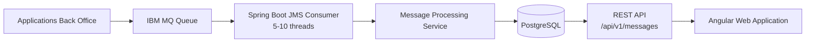

# Payment Messages


---

## Description

**Payment Messages** est une application web permettant de collecter, stocker et consulter des messages de paiement transitant via une infrastructure **IBM MQ Series**.

L'application simule un contexte bancaire où plusieurs applications Back Office déposent des messages financiers dans une file MQ. Ces messages sont ensuite :

- consommés automatiquement depuis IBM MQ (5-10 threads concurrents) ;
- persistés dans une base relationnelle PostgreSQL ;
- exposés via une API REST paginée avec filtres ;
- consultables et gérables depuis une interface Angular.

L'objectif est de proposer une solution robuste répondant aux contraintes d'un environnement bancaire :

- forte volumétrie ;
- performance ;
- résilience (retry, reprise sur erreur) ;
- traçabilité (cycle de vie complet des messages) ;
- supervision des traitements.

---

## Architecture

<p align="center">
  
</p>

<p align="center">
  <sub>Boucle de 10 s — animation SMIL, aucun script. Le rendu statique reste lisible si les animations sont désactivées.</sub>
</p>


```mermaid
flowchart LR
    A[Applications Back Office]
    --> B[IBM MQ Queue]
    B --> C[Spring Boot JMS Consumer<br/>5-10 threads]
    C --> D[Message Processing Service]
    D --> E[(PostgreSQL)]
    E --> F[REST API<br/>/api/v1/messages]
    F --> G[Angular Web Application]
```

Documentation détaillée dans [docs/architecture/](docs/architecture/) :

- [Architecture globale](docs/architecture/architecture-globale.md)
- [Architecture backend](docs/architecture/architecture-backend.md)
- [Architecture frontend](docs/architecture/architecture-frontend.md)
- [Flux de données](docs/architecture/flux.md)

---

## Stack technique

### Backend

| Technologie | Version |
|---|---|
| Java | 21 |
| Spring Boot | 4.1.0 |
| Spring Data JPA | - |
| Spring JMS | - |
| IBM MQ Client | 9.4.2.0 |
| PostgreSQL | 18 |
| H2 (tests) | - |
| Lombok | - |
| SpringDoc OpenAPI | 2.8.9 |
| Spring Boot Actuator | - |

### Frontend

| Technologie | Version |
|---|---|
| Angular | 22 (standalone, zoneless) |
| Angular Material + CDK | 22 |
| TypeScript | 6 |
| RxJS | 7.8 |
| Vitest | 4 |
| nginx (image de production) | 1.27-alpine |

### Infrastructure

| Technologie | Rôle |
|---|---|
| Docker | Conteneurisation |
| Docker Compose | Orchestration locale |

---

## Fonctionnalités

### Backend

- ✅ Consommation des messages IBM MQ (JMS Listener, session transactée, idempotence sur `messageId`)
- ✅ Persistance en base PostgreSQL, schéma piloté par Flyway
- ✅ API REST paginée avec filtres serveur (statut, date, type, recherche) + pagination par curseur
- ✅ Consultation individuelle des messages
- ✅ Statistiques par statut et agrégats du tableau de bord, calculés en SQL et mis en cache
- ✅ Suppression de messages
- ✅ Retry individuel et batch des messages en échec (batch asynchrone, par lots bornés)
- ✅ Dead Letter Queue applicative, publication après commit et reprise planifiée
- ✅ Mise à jour du statut des messages (machine à états appliquée côté serveur)
- ✅ Rétention planifiée des messages traités (désactivée par défaut)
- ✅ Documentation Swagger UI (OpenAPI)
- ✅ Gestion centralisée des erreurs
- ✅ Métriques et santé (Actuator)
- ✅ Cycle de vie à 4 statuts (RECEIVED → PROCESSED / FAILED → DEAD_LETTER)
- ✅ Simulation d'envoi : dépôt de messages de test sur la file d'entrée configurée, cadencé et borné

### Frontend

- ✅ Tableau de bord : KPI, volume horaire, répartitions par statut et par type, alertes
- ✅ Liste des messages : filtres serveur (statut, date, type, recherche), tri, pagination, tiroir de détail
- ✅ Consultation du détail : métadonnées, payload brut, rejeu et changement de statut
- ✅ Simulation d'envoi : modèles de payload, envoi unitaire ou en masse, suivi de publication

---

## Structure du projet

```
payment-messages
├── backend/
│   ├── src/main/java/com/bank/paymentmessages/
│   │   ├── config/          # JMS, cache, CORS, ETag, métriques, OpenAPI, exécuteurs, Jackson
│   │   ├── controller/      # REST : messages, configuration MQ, simulation
│   │   ├── dto/             # api/ (contrat REST) et mq/ (contrat de la file)
│   │   ├── entity/          # Entité JPA + machine à états des statuts
│   │   ├── exception/       # ProblemDetail (RFC 9457) et exceptions métier
│   │   ├── mapper/          # Mapping Entity ↔ DTO
│   │   ├── mq/              # JMS Listener, publication DLQ, reprise, publication de test
│   │   ├── repository/      # Spring Data JPA + projection de liste
│   │   ├── service/         # Logique métier, rejeu massif, simulation, rétention
│   │   └── web/             # CorrelationIdFilter (X-Request-Id + MDC)
│   ├── src/main/resources/
│   │   ├── db/migration/    # Migrations Flyway (PostgreSQL)
│   │   ├── application.yaml
│   │   ├── application-dev.yaml          # git-ignoré, à créer
│   │   └── application-dev.example.yaml
│   ├── src/test/            # *Test (Surefire, H2) et *IT (Failsafe, Testcontainers)
│   ├── pom.xml
│   └── Dockerfile
├── frontend/
│   ├── src/app/             # Angular standalone (core, features, layout, shared)
│   ├── proxy.conf.json      # Relais /api → :8080 pour `ng serve`
│   ├── nginx.conf           # Service statique + relais /api en production
│   ├── security-headers.conf
│   └── Dockerfile
├── infra/
│   ├── mq/                  # payment-queues.mqsc (création des files)
│   └── load/                # Tirs de charge : MqInjector.java, k6-api.js
├── docs/
│   ├── api/                 # Documentation API REST
│   ├── architecture/        # Documentation architecture
│   ├── database/            # Modèle de données
│   └── ibm-mq/              # Configuration IBM MQ
├── .github/workflows/ci.yml
├── docker-compose.yaml
└── README.md
```

---

## Prérequis

- **Java 21** (JDK Temurin recommandé)
- **Node.js 22**
- **Docker** et **Docker Compose**
- **Maven** (ou utiliser `./mvnw`)

---

## Configuration

### Backend

Copier et éditer le fichier d'exemple :

```bash
cp backend/src/main/resources/application-dev.example.yaml \
   backend/src/main/resources/application-dev.yaml
```

Variables d'environnement requises (ou définies dans `application-dev.yaml`) :

| Variable | Description |
|---|---|
| `DB_URL` | `jdbc:postgresql://localhost:5432/payment_messages` |
| `DB_USER` | `payment` |
| `DB_PASSWORD` | `payment` |
| `MQ_CONN_NAME` | `localhost(1414)` |
| `MQ_QUEUE` | `PAYMENT.REQUEST.QUEUE` |
| `MQ_DLQ_QUEUE` | `PAYMENT.DLQ.QUEUE` |
| `MQ_MAX_RETRIES` | `3` |

Variables optionnelles (valeurs par défaut entre parenthèses) :

| Variable | Description |
|---|---|
| `MQ_MIN_CONCURRENCY` / `MQ_MAX_CONCURRENCY` | Nombre de consommateurs JMS (`5` / `10`) |
| `DB_POOL_MAX_SIZE` / `DB_POOL_MIN_IDLE` | Dimensionnement HikariCP (`20` / `5`), à tenir ≥ `MQ_MAX_CONCURRENCY` + threads HTTP |
| `MQ_DLQ_RECOVERY_ENABLED` | Reprise planifiée des `DEAD_LETTER` non republiés (`true`) |
| `MQ_DLQ_RECOVERY_INTERVAL` | Période de la reprise en ms (`60000`) |
| `MQ_DLQ_RECOVERY_BATCH_SIZE` | Taille de lot de la reprise (`100`) |
| `SIMULATION_ENABLED` | Simulation d'envoi (`true`) — à couper là où la file d'entrée porte un vrai flux |
| `SIMULATION_MAX_COUNT` / `SIMULATION_MAX_RATE` | Bornes d'un envoi de test (`1000` messages / `200` msg/s) |
| `CORS_ALLOWED_ORIGINS` | Origines CORS autorisées (`http://localhost:4200`) |
| `MAX_PAGE_SIZE` | Borne haute de pagination (`200`) |
| `REQUEST_TIMEOUT` / `CONNECTION_TIMEOUT` | Délais maximaux (`15s` / `5s`) |
| `MANAGEMENT_PORT` | Isole l'actuator sur un port dédié (vide = port de l'API) |

> **Hors périmètre : authentification et autorisations.** L'API est ouverte, aucun compte
> n'est déclaré et aucun jeton n'est requis. Le déploiement doit donc rester sur un réseau
> de confiance.

### IBM MQ

Documentation détaillée : [docs/ibm-mq/ibm-mq-configuration.md](docs/ibm-mq/ibm-mq-configuration.md)

---

## Lancement avec Docker Compose

```bash
docker compose up -d          # pile complète, images applicatives construites au passage
docker compose up -d postgres ibm-mq   # infrastructure seule, pour développer en local
```

| Service | Port | Image | Attend |
|---|---|---|---|
| PostgreSQL | 5432 | postgres:18 | — |
| pgAdmin | 5050 | dpage/pgadmin4 | postgres sain |
| IBM MQ | 1414, 9443 | icr.io/ibm-messaging/mq | — |
| Backend Spring Boot | 8080 | build de `./backend` | postgres + ibm-mq sains |
| Frontend Angular | 4200 | build de `./frontend` (nginx) | backend |

Le démarrage est ordonné par des **sondes**, pas par un simple `depends_on` : le port 8080
écoute bien avant que Flyway, le pool JDBC et le conteneur d'écoute JMS soient prêts, donc le
backend déclare sa disponibilité sur `/actuator/health/readiness`. Le frontend est servi par
nginx, qui relaie `/api/` vers le backend : le navigateur ne voit qu'une seule origine.

Application disponible : `http://localhost:4200`

---

## Lancement Backend (dev)

```bash
docker compose up -d postgres ibm-mq   # dépendances seules
cd backend
./mvnw spring-boot:run
```

Le profil `dev` est actif par défaut : `application-dev.yaml` doit exister (cf.
[Configuration](#configuration)), sans quoi le contexte ne démarre pas.

---

## Lancement Frontend (dev)

```bash
cd frontend
npm install
ng serve
```

Application disponible : `http://localhost:4200`. Le dev-server relaie `/api` vers
`http://localhost:8080` (`proxy.conf.json`) : le backend doit tourner.

---

## API REST

L'authentification et les autorisations sont **hors périmètre** du sujet : tous les
endpoints sont ouverts.

```bash
curl -s http://localhost:8080/api/v1/messages
```

| Méthode | Path | Description |
|---|---|---|
| `GET` | `/api/v1/config` | Configuration MQ non sensible (files, gestionnaire, canal) — aucun secret |

Base path : `/api/v1/messages`

| Méthode | Path | Description |
|---|---|---|
| `GET` | `/api/v1/messages` | Liste paginée, sans payload (filtres : status, receivedAfter, type, q) |
| `GET` | `/api/v1/messages/cursor` | Liste paginée par curseur (keyset) |
| `GET` | `/api/v1/messages/stats` | Statistiques par statut (filtres : receivedAfter, type, q) |
| `GET` | `/api/v1/messages/stats/dashboard` | Agrégats du tableau de bord (volume horaire, types, tentatives, alertes) |
| `GET` | `/api/v1/messages/types` | Types de messages présents en base |
| `GET` | `/api/v1/messages/{id}` | Détail d'un message (payload inclus) |
| `DELETE` | `/api/v1/messages/{id}` | Suppression (204) |
| `POST` | `/api/v1/messages/batch/retry-failed` | Relance batch des échecs (202 + `taskId`) |
| `GET` | `/api/v1/messages/batch/retry-failed/{taskId}` | Suivi de la relance batch |
| `POST` | `/api/v1/messages/{id}/retry` | Relance individuelle |
| `PUT` | `/api/v1/messages/{id}/status` | Mise à jour du statut — corps `{ "status": "…", "reason": "…" }` |

Simulation d'envoi — base path `/api/v1/simulation` :

| Méthode | Path | Description |
|---|---|---|
| `GET` | `/api/v1/simulation/config` | File visée et plafonds (nombre de messages, cadence) |
| `POST` | `/api/v1/simulation/sends` | Dépôt de messages de test sur la file d'entrée (202 + `taskId`) |
| `GET` | `/api/v1/simulation/sends/{taskId}` | Suivi de l'envoi |

Le payload est publié **tel quel** sur la file : il repasse par le consommateur applicatif,
avec la même validation et les mêmes rejets. Ces endpoints n'écrivent rien en base.
La destination n'est pas un paramètre : c'est toujours `ibm.mq.queue`, la seule file consommée
par l'application. À couper via `app.simulation.enabled` là où cette file porte un vrai flux.

Les erreurs suivent le format `application/problem+json` (RFC 9457) et portent un
`correlationId` repris de l'en-tête `X-Request-Id`.

Documentation complète : [docs/api/api-documentation.md](docs/api/api-documentation.md)

Swagger UI : `http://localhost:8080/swagger-ui.html`

Collection Postman prête à importer (endpoints, cas d'erreur, actuator, variables chaînées
entre requêtes) : [docs/postman/](docs/postman/README.md)

---

## Tests

### Backend

```bash
cd backend
./mvnw verify                  # tests unitaires (H2) + tests d'intégration (Testcontainers)
./mvnw test                    # tests unitaires seuls, sans Docker
./mvnw verify -Dmq.it=true     # ajoute le tir de bout en bout sur un vrai IBM MQ
```

`verify` enchaîne deux campagnes : **Surefire** exécute les `*Test` sur H2, **Failsafe** les
`*IT` sur des services réels démarrés par Testcontainers. Sans démon Docker, les `*IT` sont
*skipped* et le build reste vert.

Tests couverts :

| Classe | Type | Scope |
|---|---|---|
| `PaymentMessagesApplicationTests` | Intégration | Chargement du contexte Spring |
| `PaymentMessageRepositoryTest` | JPA slice | Projection de liste, pagination keyset, purge |
| `PaymentMessageServiceTest` | Unitaire (mocks) | Logique métier, idempotence, curseur, lots bornés |
| `PaymentMessageListenerTest` | Unitaire (mocks) | Erreurs définitives / transitoires, chronomètre, purge du MDC |
| `BatchRetryServiceTest` | Unitaire (mocks) | Enchaînement des lots, plafond, échec |
| `SimulationServiceTest` | Unitaire (mocks) | Cadence, bornes, envoi unique en vol, `uniqueIds` |
| `DeadLetterDispatcherTest` | Unitaire (mocks) | Publication après commit, confirmation `dlqPublishedAt` |
| `JmsConfigTest` | Unitaire | Factory de listeners : session transactée, concurrence |
| `PaymentMessageControllerTest` | Web slice (MockMvc) | Endpoints REST, contrat de statut, garde-fous |
| `HealthProbesTest` | Intégration | Sondes `liveness`/`readiness` consommées par l'orchestrateur |
| `MetricsConfigTest` | Intégration | `/actuator/prometheus` exposé, `env` absent |
| `HttpCacheAndCorrelationTest` | Intégration | `ETag`/`304`, `X-Request-Id` |
| `PaymentMessageStatusTest` | Unitaire | Machine à états des statuts |
| `PaymentMessageMapperTest` | Unitaire | Mapping Entity ↔ DTO, calcul de `payloadSize` |
| `SchemaMigrationIT` | Testcontainers (PostgreSQL) | Migrations Flyway rejouées, `timestamptz`, index, unicité |
| `PaymentMessagePersistenceIT` | Testcontainers (PostgreSQL) | Insertion concurrente, curseur, DLQ après commit, rétention |
| `PaymentMessageMqIT` | Testcontainers (IBM MQ + PostgreSQL) | Redélivrance, idempotence, bascule DLQ — `-Dmq.it=true` |

### Tirs de charge

`infra/load/` : injecteur JMS (`MqInjector.java`, messages/s en ingestion) et scénario k6
(`k6-api.js`, p95 des endpoints de liste). Voir `infra/load/README.md`.

### Frontend

```bash
cd frontend
npm run test              # Vitest, mode observation
npm run test -- --no-watch   # exécution unique (mode CI)
```

### CI/CD

Pipeline GitHub Actions à chaque push / PR :

```yaml
- Backend: JDK 21, mvnw verify
- Frontend: Node.js 22, npm ci + npm run test -- --no-watch + npm run build
- Docker Compose: config --quiet + up -d --wait
```

---

## Observabilité

Endpoints Actuator exposés :

| Endpoint | Description |
|---|---|
| `/actuator/health` | Santé de l'application |
| `/actuator/info` | Informations (nom, version, java) |
| `/actuator/metrics` | Métriques JVM et applicatives |
| `/actuator/prometheus` | Exposition Prometheus, métriques métier comprises |

`/actuator/env` a été **retiré** : il exposait toute la configuration résolue, identifiants MQ
compris.

Métriques métier : `payment.mq.messages.received` / `.rejected` / `.duplicates`,
`payment.mq.listener.rollbacks`, `payment.dlq.publish.failures`, le chronomètre
`payment.mq.processing` (étiqueté par issue) et les jauges `payment.messages.pending`,
`.failed`, `.dead.letter`.

Chaque réponse HTTP porte un `X-Request-Id`, présent dans les lignes de log correspondantes
(`requestId`), aux côtés de `messageId` pour l'ingestion MQ.

---

## Documentation

Toute la documentation est dans le dossier [docs/](docs/).

### Architecture et contrats

| Sujet | Fichier |
|---|---|
| Architecture globale | [docs/architecture/architecture-globale.md](docs/architecture/architecture-globale.md) |
| Architecture backend | [docs/architecture/architecture-backend.md](docs/architecture/architecture-backend.md) |
| Architecture frontend | [docs/architecture/architecture-frontend.md](docs/architecture/architecture-frontend.md) |
| Flux de données | [docs/architecture/flux.md](docs/architecture/flux.md) |
| API REST | [docs/api/api-documentation.md](docs/api/api-documentation.md) |
| Collection Postman (38 requêtes, prête à importer) | [docs/postman/](docs/postman/README.md) |
| Jeux de données de la file d'entrée (33 payloads + script d'envoi) | [docs/jdd/](docs/jdd/README.md) |
| Modèle de données | [docs/database/database-model.md](docs/database/database-model.md) |
| Configuration IBM MQ | [docs/ibm-mq/ibm-mq-configuration.md](docs/ibm-mq/ibm-mq-configuration.md) |

Les diagrammes des documents d'architecture sont écrits en Mermaid ; leur **rendu PNG** est
déposé à côté d'eux dans [docs/architecture/](docs/architecture/), pour les lecteurs dont le
visualiseur Markdown n'exécute pas Mermaid.

### Mécanismes détaillés

| Sujet | Fichier |
|---|---|
| Cycle de vie des statuts d'un message | [docs/Statuts-messages.md](docs/Statuts-messages.md) |
| Dead Letter Queue : rôle, implémentation, reprise | [docs/DLQ.md](docs/DLQ.md) |
| Le rejeu : bouton « Rejouer » et carte « Tentatives » | [docs/Util-Rejeu.md](docs/Util-Rejeu.md) |
| L'onglet « Simulation d'envoi » | [docs/Onglet-Sim.md](docs/Onglet-Sim.md) |

### Exploitation et suite

| Sujet | Fichier |
|---|---|
| Déploiement | [docs/Deployment.md](docs/Deployment.md) |
| Axes d'amélioration (audit performance / résilience) | [docs/ameliorations.md](docs/ameliorations.md) |
| Pitch de présentation, questions d'entretien, perspectives | [docs/Pitch-and-Futur.md](docs/Pitch-and-Futur.md) |

### Guide utilisateur

Parcours fonctionnels écran par écran, captures à l'appui :
[docs/user-guide/](docs/user-guide/README.md) — tableau de bord, consultation, recherche et
filtres, détail d'un message, actions (rejeu, statut, suppression), simulation d'envoi,
préférences d'interface.

---

## Auteur

**Mouhamadou LO** — [mouhamadoulo39@gmail.com](mailto:mouhamadoulo39@gmail.com)
