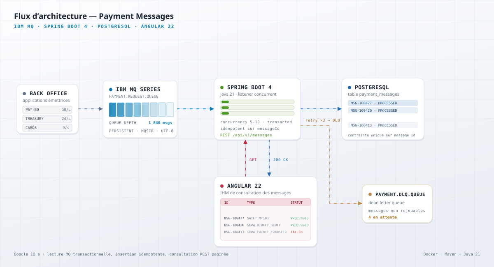
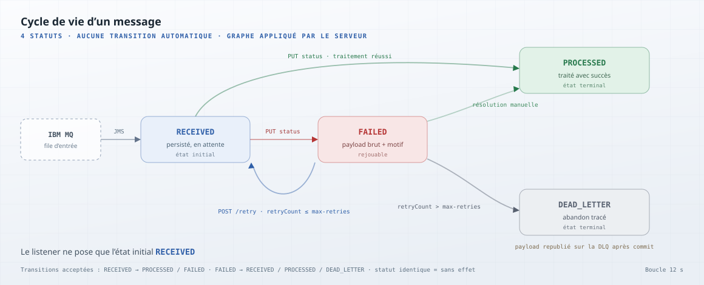

# Payment Messages


Collecte, stockage et consultation des messages de paiement transitant par **IBM MQ** : un listener
JMS persiste en **PostgreSQL**, une **API REST** paginée expose, une **IHM Angular** consulte et pilote.

<p align="center">
  
</p>

---

## Démarrage

```bash
cp backend/src/main/resources/application-dev.example.yaml \
   backend/src/main/resources/application-dev.yaml     # requis : sans ce fichier, pas de contexte
docker compose up -d                                   # pile complète, images applicatives buildées
```

| Accès | URL |
|---|---|
| IHM | `http://localhost:4200` |
| API · Swagger UI | `http://localhost:8080/api/v1/messages` · `/swagger-ui.html` |
| pgAdmin · console MQ | `http://localhost:5050` · `https://localhost:9443` |

### Développer en local, backend et frontend hors conteneur

```bash
docker compose up -d postgres ibm-mq   # infrastructure seule

cd backend  && ./mvnw spring-boot:run  # profil dev par défaut → :8080
cd frontend && npm install && ng serve  # relais /api vers :8080 → :4200
```

Prérequis : **Java 21**, **Node.js 22**, **Docker Compose**. Sur Windows, `mvnw.cmd`.

---

## Ce que fait l'application

| Brique | Comportement |
|---|---|
| **Ingestion** | `@JmsListener`, 5-10 consommateurs, session transactée, idempotence sur `messageId` |
| **Contrat d'entrée** | validé en profondeur (cascade `@Valid` sur `payment`), tailles bornées sur celles des colonnes |
| **Erreurs** | définitives → ligne `FAILED` + payload brut ; transitoires → rollback et redélivrance bornée |
| **Persistance** | PostgreSQL, schéma piloté par Flyway (`ddl-auto: validate`) |
| **API** | pagination page / curseur, 4 filtres serveur, agrégats SQL cachés, `ETag`, RFC 9457 |
| **Reprise** | rejeu unitaire ou par lots bornés (202 + `taskId`), DLQ applicative publiée après commit |
| **IHM** | tableau de bord, liste filtrable et triable, détail, changement de statut, simulation d'envoi |
| **Exploitation** | Actuator + Prometheus, `X-Request-Id` corrélé aux logs, rétention planifiée (option) |

<p align="center">
  
</p>

> **Hors périmètre : authentification et autorisations.** Aucun compte, aucun jeton, aucun rôle —
> tous les endpoints répondent en clair. Le déploiement doit rester sur un réseau de confiance.

---

## Configuration

| Requise | Exemple |
|---|---|
| `DB_URL` | `jdbc:postgresql://localhost:5432/payment_messages` |
| `DB_USER` / `DB_PASSWORD` | `payment` / `payment` |
| `MQ_QMGR` / `MQ_CHANNEL` | `QM1` / `DEV.APP.SVRCONN` |
| `MQ_CONN_NAME` | `localhost(1414)` |
| `MQ_USER` / `MQ_PASSWORD` | `app` / `passw0rd` |
| `MQ_QUEUE` / `MQ_DLQ_QUEUE` | `PAYMENT.REQUEST.QUEUE` / `PAYMENT.DLQ.QUEUE` |
| `MQ_MAX_RETRIES` | `3` |

| Option (défaut) | Effet |
|---|---|
| `MQ_MIN_CONCURRENCY` / `MQ_MAX_CONCURRENCY` (`5` / `10`) | consommateurs JMS |
| `DB_POOL_MAX_SIZE` / `DB_POOL_MIN_IDLE` (`20` / `5`) | HikariCP, à tenir ≥ consommateurs + threads HTTP |
| `MQ_DLQ_RECOVERY_ENABLED` / `_INTERVAL` / `_BATCH_SIZE` (`true` / `60000` / `100`) | reprise des `DEAD_LETTER` non republiés |
| `STATS_CACHE_TTL` (`15s`) | caches de stats **et** `Cache-Control` associé — à garder égaux |
| `BATCH_RETRY_SIZE` / `BATCH_RETRY_MAX` (`500` / `100000`) | taille et plafond du rejeu massif |
| `RETENTION_ENABLED` (`false`) + `RETENTION_*` | purge planifiée des messages traités |
| `SIMULATION_ENABLED` (`true`) / `_MAX_COUNT` (`1000`) / `_MAX_RATE` (`200`) | simulation d'envoi et ses bornes |
| `CORS_ALLOWED_ORIGINS` · `MAX_PAGE_SIZE` (`200`) · `REQUEST_TIMEOUT` (`15s`) · `CONNECTION_TIMEOUT` (`5s`) | garde-fous navigateur et HTTP |
| `JPA_DDL_AUTO` (`validate`) · `FLYWAY_ENABLED` (`true`) · `MANAGEMENT_PORT` (vide) | schéma et port de l'actuator |

Le schéma appartient à **Flyway** (`backend/src/main/resources/db/migration`) : une évolution
d'entité sans migration correspondante fait échouer le démarrage.

---

## API REST

```bash
curl -s http://localhost:8080/api/v1/messages
```

15 endpoints, tous ouverts, sous `/api/v1` (`/messages`, `/config`, `/simulation`) — contrat
complet, paramètres, exemples et cas d'erreur : **[docs/api/api-documentation.md](docs/api/api-documentation.md)**,
ou Swagger UI sur `http://localhost:8080/swagger-ui.html`.

La simulation **publie sur la file d'entrée et n'écrit rien en base** : les messages reviennent par
le consommateur applicatif, avec les mêmes rejets.

---

## Tests

```bash
cd backend
./mvnw test                    # unitaires seuls, sur H2, sans Docker
./mvnw verify                  # + tests d'intégration (Testcontainers)
./mvnw verify -Dmq.it=true     # + le tir de bout en bout sur un vrai IBM MQ

cd frontend
npm run test -- --no-watch     # Vitest, exécution unique
```

Sans démon Docker, les `*IT` sont *skipped* et le build reste vert — la CI est donc le seul endroit
où les migrations Flyway rencontrent un vrai PostgreSQL. GitHub Actions à chaque push et PR :
backend `mvnw verify` · frontend `npm ci` + tests + build · `docker compose config` + `up -d --wait`.
Tirs de charge dans `infra/load/` (injecteur JMS, scénario k6).

---

## Documentation

| Sujet | Fichier |
|---|---|
| Architecture globale, backend, frontend, flux | [docs/architecture/](docs/architecture/architecture-globale.md) |
| API REST (contrat complet, exemples, erreurs) | [docs/api/](docs/api/api-documentation.md) |
| Modèle de données et requêtes notables | [docs/database/](docs/database/database-model.md) |
| Configuration IBM MQ (files, canal, MQSC) | [docs/ibm-mq/](docs/ibm-mq/ibm-mq-configuration.md) |
| Guide utilisateur, écran par écran | [docs/user-guide/](docs/user-guide/README.md) |
| Collection Postman · jeux de données de la file | [docs/postman/](docs/postman/README.md) · [docs/jdd/](docs/jdd/README.md) |

Diagrammes animés dans [docs/images/](docs/images/) — SVG autonomes, sans script.

---

## Observabilité

`/actuator/health` (sondes `liveness` / `readiness`), `/actuator/info`, `/actuator/metrics`,
`/actuator/prometheus`. **`env` a été retiré** : il exposait toute la configuration résolue,
identifiants MQ compris.

Métriques métier : `payment.mq.messages.received` / `.rejected` / `.duplicates`,
`payment.mq.listener.rollbacks`, `payment.dlq.publish.failures`, le chronomètre
`payment.mq.processing` (étiqueté par issue) et les jauges `payment.messages.pending` / `.failed` /
`.dead.letter`. Chaque réponse porte un `X-Request-Id`, repris dans les logs aux côtés du `messageId`.

---

## Structure et stack

```
payment-messages
├── backend/     # Spring Boot 4.1, Java 21 — config, controller, dto, entity, exception,
│                #   mapper, mq, repository, service, web ; db/migration (Flyway)
├── frontend/    # Angular 22 standalone, zoneless — core, features, layout, shared
├── infra/       # mq/ (MQSC), load/ (injecteur JMS, k6)
├── docs/        # architecture, api, database, ibm-mq, user-guide, postman, jdd, images
└── docker-compose.yaml · .github/workflows/ci.yml
```

| Backend | Frontend | Infra |
|---|---|---|
| Java 21 · Spring Boot 4.1.0 | Angular 22 (standalone, zoneless) | Docker · Docker Compose |
| Spring Data JPA · Spring JMS | Angular Material + CDK 22 | PostgreSQL 18 · IBM MQ (image `latest`) |
| IBM MQ Client 9.4.2.0 · Flyway · Caffeine | TypeScript 6 · RxJS 7.8 | nginx 1.27-alpine · node 22-alpine |
| Actuator · Micrometer · SpringDoc 2.8.9 | Vitest 4 | H2 · Testcontainers (tests) |

Le **client** IBM MQ est épinglé en 9.4.2.0 (via `mq-jms-spring-boot-starter`) ; l'**image**
serveur de `docker-compose.yaml` suit `latest`, à figer sur un environnement partagé.

---

**Mouhamadou LO** — [mouhamadoulo39@gmail.com](mailto:mouhamadoulo39@gmail.com)
