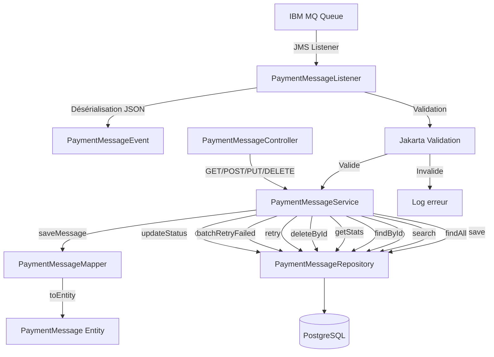

# Architecture Backend

## 1. Présentation

Le backend est une application **Spring Boot 4.1.0** en **Java 21**. Il assure :

- la consommation de messages depuis **IBM MQ** via JMS ;
- la persistance des messages dans **PostgreSQL** via JPA ;
- l'exposition d'une **API REST** pour la consultation et la gestion des messages ;
- la supervision via **Spring Boot Actuator**.

---

## 2. Stack technique

| Technologie | Version | Rôle |
|---|---|---|
| Java | 21 | Langage |
| Spring Boot | 4.1.0 | Framework |
| Spring Data JPA | - | Accès base de données |
| Spring Validation | - | Validation des entrées |
| Spring JMS | - | Consommation files MQ |
| IBM MQ Client | 9.4.2.0 | Client IBM MQ |
| PostgreSQL | 18 | Base de données |
| H2 | - | Base de test (embarquée) |
| Lombok | - | Boilerplate |
| Jackson | - | Sérialisation JSON |
| SpringDoc OpenAPI | 2.8.9 | Documentation API |
| Spring Boot Actuator | - | Métriques et santé |

---

## 3. Structure du code

```
com.bank.paymentmessages
├── PaymentMessagesApplication.java     # Classe principale
├── config/
│   └── JacksonConfig.java              # Configuration Jackson (JavaTimeModule)
├── controller/
│   └── PaymentMessageController.java   # Endpoints REST
├── dto/
│   ├── api/
│   │   └── PaymentMessageDto.java      # DTO de réponse API
│   └── mq/
│       ├── PaymentMessageEvent.java    # DTO entrant (MQ)
│       ├── Payment.java                # Détails du paiement
│       ├── Debtor.java                 # Informations débiteur
│       └── Creditor.java               # Informations créancier
├── entity/
│   ├── PaymentMessage.java             # Entité JPA
│   └── PaymentMessageStatus.java       # Enum des statuts
├── exception/
│   ├── PaymentMessageNotFoundException.java
│   └── GlobalExceptionHandler.java     # Handler global (@ControllerAdvice)
├── mapper/
│   └── PaymentMessageMapper.java       # Mapping Entity <-> DTO
├── mq/
│   └── PaymentMessageListener.java     # Listener JMS
├── repository/
│   └── PaymentMessageRepository.java   # Repository JPA
└── service/
    └── PaymentMessageService.java      # Logique métier
```

---

## 4. Diagramme de l'architecture backend



---

## 5. Couches et responsabilités

### 5.1 Controller (`PaymentMessageController`)

Point d'entrée de l'API REST. Base path : `/api/v1/messages`.

- Annoté `@RestController`, `@RequestMapping("/api/v1/messages")`
- Documentation OpenAPI via `@Tag`, `@Operation`, `@ApiResponses`
- Délègue toute la logique au service

### 5.2 Service (`PaymentMessageService`)

Couche métier. Contient toute la logique de traitement :

- Création et mise à jour des messages
- Recherche paginée avec filtres (statut, date)
- Statistiques par statut
- Gestion des retries (individuel et batch)
- Gestion des exceptions métier

### 5.3 Repository (`PaymentMessageRepository`)

Interface Spring Data JPA étendant `JpaRepository<PaymentMessage, Long>`.

Méthodes dérivées :

| Méthode | Requête générée |
|---|---|
| `findByMessageId(String)` | `WHERE message_id = ?` |
| `findByReference(String)` | `WHERE reference = ?` |
| `findByStatus(PaymentMessageStatus, Pageable)` | `WHERE status = ?` avec pagination |
| `findByReceivedAtAfter(LocalDateTime, Pageable)` | `WHERE received_at > ?` avec pagination |
| `findByStatusAndReceivedAtAfter(...)` | `WHERE status = ? AND received_at > ?` avec pagination |
| `findAllByStatus(PaymentMessageStatus)` | `WHERE status = ?` (sans pagination) |
| `countByStatus()` | `SELECT status, COUNT(*) GROUP BY status` (JPQL) |

### 5.4 JMS Listener (`PaymentMessageListener`)

- Écoute la file configurée via `${ibm.mq.queue}`
- Concurrence : `5-10` threads
- Mode d'acquittement : `auto`
- Désérialise le payload JSON en `PaymentMessageEvent`
- Valide avec Jakarta Validation
- Persiste via `PaymentMessageService.saveMessage()`

### 5.5 Mapper (`PaymentMessageMapper`)

Classe utilitaire (constructeur privé) avec deux méthodes statiques :

- `toDto(PaymentMessage)` → `PaymentMessageDto`
- `toEntity(PaymentMessageEvent, String rawPayload)` → `PaymentMessage`

### 5.6 Exception Handler (`GlobalExceptionHandler`)

| Exception | Statut HTTP |
|---|---|
| `PaymentMessageNotFoundException` | `404 NOT FOUND` |
| `IllegalArgumentException` | `400 BAD REQUEST` |
| `Exception` (catch-all) | `500 INTERNAL SERVER ERROR` |

Toutes les réponses d'erreur suivent le format :

```json
{
  "status": 404,
  "error": "Not Found",
  "message": "Message introuvable avec l'id : 42",
  "timestamp": "2025-01-15T10:30:00.000+00:00"
}
```

---

## 6. Configuration

### 6.1 Profiles

- **dev** (actif par défaut) : configuration de développement avec variables d'environnement
- **test** : utilisé pour les tests unitaires (H2)

### 6.2 Variables d'environnement

| Variable | Description |
|---|---|
| `DB_URL` | URL JDBC PostgreSQL |
| `DB_USER` | Utilisateur base |
| `DB_PASSWORD` | Mot de passe base |
| `JPA_DDL_AUTO` | Stratégie DDL (`update`, `validate`, etc.) |
| `MQ_QMGR` | Queue Manager IBM MQ |
| `MQ_CHANNEL` | Channel de connexion |
| `MQ_CONN_NAME` | Hôte et port du serveur MQ |
| `MQ_USER` | Utilisateur MQ |
| `MQ_PASSWORD` | Mot de passe MQ |
| `MQ_QUEUE` | File à écouter |
| `MQ_DLQ_QUEUE` | Dead Letter Queue applicative |
| `MQ_MAX_RETRIES` | Nombre de rejeux avant `DEAD_LETTER` |
| `SERVER_PORT` | Port du serveur |

### 6.3 Actuator

Endpoints exposés : `health`, `info`, `metrics`, `env`

---

## 7. Tests

5 classes de test couvrant :

- **ApplicationTests** : chargement du contexte Spring
- **RepositoryTest** : couche JPA (save, findById, findByMessageId, findByReference)
- **ServiceTest** : logique métier (mocks)
- **ControllerTest** : endpoints REST (MockMvc)
- **MapperTest** : mapping Entity ↔ DTO

Exécution :

```bash
cd backend
./mvnw verify
```

Un pipeline CI (GitHub Actions) exécute `mvnw verify` à chaque push et PR.
