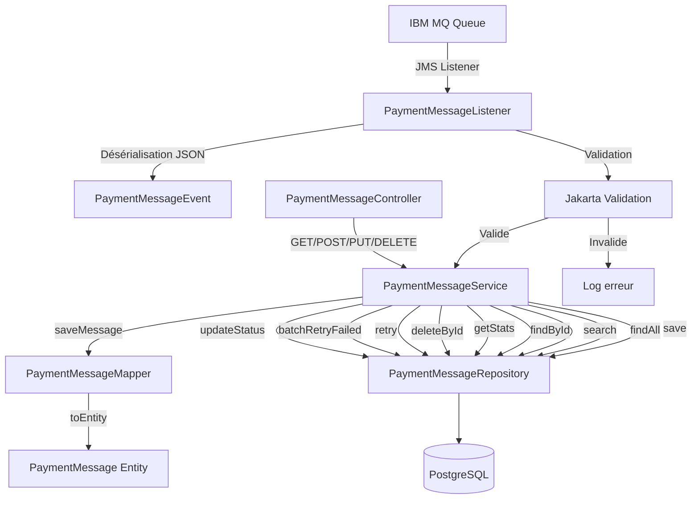

# Architecture Backend

## 1. Présentation

Le backend est une application **Spring Boot 4.1.0** en **Java 21**. Il assure :

- la consommation de messages depuis **IBM MQ** via JMS ;
- la persistance des messages dans **PostgreSQL** via JPA ;
- l'exposition d'une **API REST** pour la consultation et la gestion des messages ;
- la supervision via **Spring Boot Actuator**.

---

## 2. Stack technique

| Technologie | Version | Rôle |
|---|---|---|
| Java | 21 | Langage |
| Spring Boot | 4.1.0 | Framework |
| Spring Data JPA | - | Accès base de données |
| Spring Validation | - | Validation des entrées |
| Spring JMS | - | Consommation files MQ |
| IBM MQ Client | 9.4.2.0 | Client IBM MQ |
| PostgreSQL | 18 | Base de données |
| H2 | - | Base de test (embarquée) |
| Lombok | - | Boilerplate |
| Jackson | - | Sérialisation JSON |
| SpringDoc OpenAPI | 2.8.9 | Documentation API |
| Spring Boot Actuator | - | Métriques et santé |
| Flyway | - | Migrations de schéma (`db/migration`) |
| Caffeine | - | Cache court des statistiques |
| Spring Security | - | API fermée, jetons JWT (HMAC-SHA256) |
| OAuth2 Resource Server | - | Vérification des jetons portés par `Authorization: Bearer` |
| Micrometer + Prometheus | - | Métriques métier (`/actuator/prometheus`) |
| Micrometer Tracing (OTel) | - | `traceId`/`spanId` dans les logs |

---

## 3. Structure du code

```
com.bank.paymentmessages
├── PaymentMessagesApplication.java     # Classe principale
├── config/
│   ├── JacksonConfig.java              # Personnalisation du JsonMapper Boot
│   ├── JmsConfig.java                  # Factory de listeners + ErrorHandler
│   ├── CacheConfig.java                # @EnableCaching (cache messageStats)
│   ├── BatchRetryExecutorConfig.java   # Exécuteur dédié au rejeu massif
│   ├── SecurityConfig.java             # Chaîne de filtres, JWT, rôles, CORS
│   ├── SecurityProperties.java         # app.security.* (secret, comptes, origines)
│   ├── MetricsConfig.java              # Jauges métier (pending, failed, dead letter)
│   ├── HttpCacheConfig.java            # Filtre ETag sur les lectures de messages
│   └── OpenApiConfig.java              # Schéma de sécurité exposé à Swagger UI
├── controller/
│   ├── PaymentMessageController.java   # Endpoints REST
│   ├── AuthController.java             # POST /auth/login (émission du jeton)
│   └── ConfigController.java           # Configuration MQ non sensible pour l'IHM
├── dto/
│   ├── api/
│   │   ├── PaymentMessageDto.java          # DTO de détail (payload inclus)
│   │   ├── PaymentMessageSummaryDto.java   # DTO de liste (sans payload)
│   │   ├── CursorPageDto.java              # Page paginée par curseur
│   │   ├── UpdateStatusRequest.java        # Corps de PUT /{id}/status ({status, reason})
│   │   ├── LoginRequest.java               # Identifiants de connexion
│   │   └── LoginResponse.java              # Jeton émis + rôles
│   └── mq/
│       ├── PaymentMessageEvent.java    # DTO entrant (MQ)
│       ├── Payment.java                # Détails du paiement
│       ├── Debtor.java                 # Informations débiteur
│       └── Creditor.java               # Informations créancier
├── entity/
│   ├── PaymentMessage.java             # Entité JPA
│   └── PaymentMessageStatus.java       # Enum des statuts
├── exception/
│   ├── PaymentMessageNotFoundException.java
│   ├── InvalidStatusTransitionException.java  # Transition refusée par la machine à états
│   └── GlobalExceptionHandler.java     # ProblemDetail (RFC 9457), étend ResponseEntityExceptionHandler
├── mapper/
│   └── PaymentMessageMapper.java       # Mapping Entity <-> DTO
├── mq/
│   ├── PaymentMessageListener.java     # Listener JMS
│   ├── DeadLetterPublisher.java        # Envoi sur la DLQ applicative
│   ├── DeadLetterRequestedEvent.java   # Demande de publication DLQ
│   ├── DeadLetterDispatcher.java       # Publication DLQ après commit
│   └── DeadLetterRecoveryJob.java      # Reprise des DLQ non confirmées
├── repository/
│   ├── PaymentMessageRepository.java   # Repository JPA
│   └── PaymentMessageSummary.java      # Projection de liste (sans payload)
├── service/
│   ├── PaymentMessageService.java      # Logique métier
│   ├── BatchRetryService.java          # Rejeu massif par lots, en tâche de fond
│   ├── BatchRetryTask.java             # État d'un rejeu massif
│   ├── Cursor.java                     # Curseur de pagination keyset
│   ├── TokenService.java               # Émission des jetons JWT
│   └── MessageRetentionJob.java        # Purge planifiée des PROCESSED
└── web/
    └── CorrelationIdFilter.java        # X-Request-Id + MDC sur chaque requête
```

---

## 4. Diagramme de l'architecture backend


```mermaid
flowchart TD
    MQ[IBM MQ Queue] -->|JMS Listener| LISTENER[PaymentMessageListener]
    LISTENER -->|Désérialisation JSON| EVENT[PaymentMessageEvent]
    LISTENER -->|Validation| VALIDATE[Jakarta Validation]
    VALIDATE -->|Valide| SERVICE[PaymentMessageService]
    VALIDATE -->|Invalide| LOG[Log erreur]
    SERVICE -->|saveMessage| MAPPER[PaymentMessageMapper]
    MAPPER -->|toEntity| ENTITY[PaymentMessage Entity]
    SERVICE -->|save| REPO[PaymentMessageRepository]
    REPO --> DB[(PostgreSQL)]

    CTRL[PaymentMessageController] -->|GET/POST/PUT/DELETE| SERVICE
    SERVICE -->|findAll| REPO
    SERVICE -->|search| REPO
    SERVICE -->|findById| REPO
    SERVICE -->|getStats| REPO
    SERVICE -->|deleteById| REPO
    SERVICE -->|retry| REPO
    SERVICE -->|batchRetryFailed| REPO
    SERVICE -->|updateStatus| REPO
```

---

## 5. Couches et responsabilités

### 5.1 Controller (`PaymentMessageController`)

Point d'entrée de l'API REST. Base path : `/api/v1/messages`.

- Annoté `@RestController`, `@RequestMapping("/api/v1/messages")`
- Documentation OpenAPI via `@Tag`, `@Operation`, `@ApiResponses`
- Délègue toute la logique au service

### 5.2 Service (`PaymentMessageService`)

Couche métier. Contient toute la logique de traitement :

- Création et mise à jour des messages
- Recherche paginée avec filtres (statut, date), **sans payload** (projection de liste)
- Pagination par curseur (`searchByCursor`) pour la navigation séquentielle
- Statistiques par statut, **mises en cache** (`messageStats`, TTL court, invalidé à chaque écriture)
- Rejeu individuel et rejeu par **lots bornés** (`retryFailedBatch`)
- Purge de rétention par lots (`purgeProcessedBefore`)
- Gestion des exceptions métier

**Transactions** : la classe est `@Transactional(readOnly = true)` par défaut, chaque écriture
est annotée explicitement. Deux exceptions assumées :

- les insertions d'ingestion (`saveMessage`, `savePermanentFailure`) tournent en
  `Propagation.NOT_SUPPORTED` — la violation de contrainte d'un doublon reste ainsi confinée
  à la transaction interne de `repository.save`, condition de l'idempotence ;
- la publication DLQ n'a jamais lieu dans la transaction : le service émet un
  `DeadLetterRequestedEvent`, publié par `DeadLetterDispatcher` **après commit**.

Le champ `@Version` de l'entité arbitre deux changements de statut concurrents : le second
échoue en `409` au lieu d'écraser le premier.

### 5.2.1 Rejeu massif (`BatchRetryService`)

Le rejeu global ne charge plus toute la table : il enchaîne des lots bornés
(`app.batch-retry.batch-size`, 500 par défaut), chacun dans sa propre transaction, sur un
exécuteur mono-thread dédié. L'API répond `202 Accepted` avec un `taskId` suivi par
`GET /batch/retry-failed/{taskId}`. Un seul rejeu en vol à la fois ; le plafond
`app.batch-retry.max-messages` interrompt un rejeu trop volumineux (`truncated`).

### 5.3 Repository (`PaymentMessageRepository`)

Interface Spring Data JPA étendant `JpaRepository<PaymentMessage, Long>`.

Méthodes dérivées :

| Méthode | Requête générée |
|---|---|
| `findByMessageId(String)` | `WHERE message_id = ?` |
| `existsByMessageId(String)` | `SELECT COUNT(*) … WHERE message_id = ?` (idempotence de l'ingestion) |
| `findByReference(String)` | `WHERE reference = ?` |
| `findByStatusAndDlqPublishedAtIsNull(...)` | `WHERE status = ? AND dlq_published_at IS NULL` (reprise DLQ) |
| `findAllProjectedBy(Pageable)` | liste paginée, projection sans payload |
| `findByStatus(PaymentMessageStatus, Pageable)` | `WHERE status = ?`, projection sans payload |
| `findByReceivedAtAfter(OffsetDateTime, Pageable)` | `WHERE received_at > ?`, projection sans payload |
| `findByStatusAndReceivedAtAfter(...)` | `WHERE status = ? AND received_at > ?`, projection sans payload |
| `findNextPage(...)` | pagination keyset : `(received_at, id) < (curseur)`, `ORDER BY received_at DESC, id DESC` (JPQL) |
| `findAllByStatus(PaymentMessageStatus, Pageable)` | lot borné d'entités complètes (rejeu massif) |
| `findPurgeableIds(status, cutoff, Pageable)` | identifiants purgeables par la rétention (JPQL) |
| `countByStatus()` | `SELECT status, COUNT(*) GROUP BY status` (JPQL) |

Les méthodes de liste renvoient `PaymentMessageSummary` : Spring Data génère un
`select new …(p.id, p.messageId, …)`, la colonne `payload` n'est donc pas lue.

### 5.4 JMS Listener (`PaymentMessageListener`)

- Écoute la file configurée via `${ibm.mq.queue}`
- Concurrence : `spring.jms.listener.min/max-concurrency` (5-10 par défaut, pilotable par environnement)
- Mode d'acquittement : session **transactée** — un rollback provoque une redélivrance
- Désérialise le payload JSON en `PaymentMessageEvent` (`JsonMapper` Jackson 3 auto-configuré)
- Valide avec Jakarta Validation
- Persiste via `PaymentMessageService.saveMessage()`, idempotent sur `messageId`
- **Erreurs définitives** (JSON illisible, validation en échec) : ligne `FAILED` avec le payload
  brut et le motif, puis acquittement — le message reste rejouable
- **Erreurs transitoires** (base indisponible) : exception relancée → rollback → redélivrance,
  bornée côté queue manager par `BOTHRESH` / `BOQNAME`
- Les rollbacks sont tracés et comptés par l'`ErrorHandler` de `config/JmsConfig`

### 5.5 Mapper (`PaymentMessageMapper`)

Classe utilitaire (constructeur privé) :

- `toDto(PaymentMessage)` → `PaymentMessageDto` (détail, payload inclus)
- `toSummaryDto(PaymentMessageSummary)` → `PaymentMessageSummaryDto` (liste, sans payload)
- `toEntity(PaymentMessageEvent, String rawPayload)` → `PaymentMessage`, avec calcul de
  `payloadSize` (octets UTF-8) à l'ingestion
- `toFailedEntity(messageId, reference, messageType, rawPayload, errorMessage)` → `PaymentMessage`
  en statut `FAILED` (rejet définitif d'un message entrant)

### 5.6 Exception Handler (`GlobalExceptionHandler`)

La classe étend `ResponseEntityExceptionHandler` : les exceptions déjà qualifiées par Spring
(corps illisible, paramètre manquant, méthode non supportée) gardent leur statut d'origine au
lieu d'être dégradées en 500 par un fourre-tout.

| Exception | Statut HTTP |
|---|---|
| `PaymentMessageNotFoundException` | `404 NOT FOUND` |
| `IllegalArgumentException` | `400 BAD REQUEST` |
| `MethodArgumentNotValidException` | `400 BAD REQUEST` + `errors` par champ |
| `AuthenticationException` | `401 UNAUTHORIZED` (motif jamais détaillé) |
| `AccessDeniedException` | `403 FORBIDDEN` |
| `OptimisticLockingFailureException` | `409 CONFLICT` (modification concurrente) |
| `InvalidStatusTransitionException` | `422 UNPROCESSABLE ENTITY` + `from`/`to`/`allowedTransitions` |
| `Exception` (catch-all) | `500 INTERNAL SERVER ERROR`, message générique + `correlationId` |

Format `application/problem+json` (RFC 9457) :

```json
{
  "type": "urn:payment-messages:not-found",
  "title": "Ressource inexistante",
  "status": 404,
  "detail": "Message introuvable avec l'id : 42",
  "instance": "/api/v1/messages/42",
  "timestamp": "2026-07-25T10:30:00+02:00",
  "correlationId": "8f2c1e2a-6b41-4a0e-9a55-1d0e6b3c7a12"
}
```

Les refus produits par la chaîne de filtres (401/403) n'atteignent pas ce handler : ils sont
formatés à l'identique par `SecurityConfig`.

### 5.7 Sécurité (`SecurityConfig`)

L'API est fermée : `/api/v1/**` exige un jeton, sauf `POST /api/v1/auth/login`. Le service
signe et vérifie lui-même ses jetons (HMAC-SHA256, secret `app.security.jwt.secret`) ; passer
à un fournisseur OAuth2 externe consisterait à remplacer le `JwtDecoder` par
`NimbusJwtDecoder.withJwkSetUri(...)` et à retirer l'émission.

- session **sans état**, donc sans cookie ni CSRF ;
- rôles portés par la revendication `roles`, préfixés `ROLE_` à la vérification ;
- `DELETE /{id}`, `PUT /{id}/status` et `POST /batch/retry-failed` exigent `ADMIN`, le reste
  un simple compte authentifié ;
- publics : `/actuator/health`, `/actuator/info`, et Swagger UI tant que
  `app.security.public-docs` vaut `true` ;
- comptes déclarés en configuration (`app.security.users[*]`), mot de passe préfixé par son
  algorithme (`{bcrypt}`, `{noop}`) via un `DelegatingPasswordEncoder`.

### 5.8 Observabilité (`MetricsConfig`, `CorrelationIdFilter`)

| Métrique | Type | Sens |
|---|---|---|
| `payment.mq.messages.received` | compteur | messages persistés depuis la file |
| `payment.mq.messages.rejected` | compteur | rejets définitifs (`FAILED`) |
| `payment.mq.messages.duplicates` | compteur | redélivrances ignorées |
| `payment.mq.listener.rollbacks` | compteur | échecs transitoires → redélivrance |
| `payment.dlq.publish.failures` | compteur | publications DLQ en échec |
| `payment.mq.processing` | chronomètre | durée de traitement, étiquetée par issue (`persisted`, `duplicate`, `rejected`, `error`) |
| `payment.messages.pending` / `.failed` / `.dead.letter` | jauges | états courants, lus via l'agrégat mis en cache |

Corrélation : `CorrelationIdFilter` publie un `requestId` dans le MDC et le renvoie en
`X-Request-Id` ; le listener JMS publie `messageId`, `reference` et `jmsMessageId`. Les deux
apparaissent dans chaque ligne de log (`logging.pattern.level`). Le bridge Micrometer Tracing
ajoute `traceId`/`spanId` ; il suffit d'ajouter un exportateur OTLP pour émettre vers un
collecteur.

---

## 6. Configuration

### 6.1 Profiles

- **dev** (actif par défaut) : configuration de développement avec variables d'environnement
- **test** : utilisé pour les tests unitaires (H2)

### 6.2 Variables d'environnement

| Variable | Description |
|---|---|
| `DB_URL` | URL JDBC PostgreSQL |
| `DB_USER` | Utilisateur base |
| `DB_PASSWORD` | Mot de passe base |
| `JPA_DDL_AUTO` | Stratégie DDL — `validate` désormais, le schéma étant géré par Flyway |
| `MQ_QMGR` | Queue Manager IBM MQ |
| `MQ_CHANNEL` | Channel de connexion |
| `MQ_CONN_NAME` | Hôte et port du serveur MQ |
| `MQ_USER` | Utilisateur MQ |
| `MQ_PASSWORD` | Mot de passe MQ |
| `MQ_QUEUE` | File à écouter |
| `MQ_DLQ_QUEUE` | Dead Letter Queue applicative |
| `MQ_MAX_RETRIES` | Nombre de rejeux avant `DEAD_LETTER` |
| `SERVER_PORT` | Port du serveur |
| `JWT_SECRET` | Secret de signature des jetons, **32 octets minimum** (refus au démarrage sinon) |

Variables optionnelles :

| Variable | Défaut | Description |
|---|---|---|
| `MQ_MIN_CONCURRENCY` / `MQ_MAX_CONCURRENCY` | `5` / `10` | Consommateurs JMS |
| `DB_POOL_MAX_SIZE` / `DB_POOL_MIN_IDLE` | `20` / `5` | HikariCP, à tenir ≥ `MQ_MAX_CONCURRENCY` + threads HTTP |
| `MQ_DLQ_RECOVERY_ENABLED` | `true` | Reprise planifiée des `DEAD_LETTER` non republiés |
| `MQ_DLQ_RECOVERY_INTERVAL` | `60000` | Période de la reprise (ms) |
| `MQ_DLQ_RECOVERY_BATCH_SIZE` | `100` | Taille de lot de la reprise |
| `FLYWAY_ENABLED` | `true` | Migrations de schéma au démarrage |
| `STATS_CACHE_TTL` | `15s` | Durée de vie du cache `/stats` |
| `BATCH_RETRY_SIZE` | `500` | Taille de lot du rejeu massif |
| `BATCH_RETRY_MAX` | `100000` | Plafond de sécurité d'un rejeu massif |
| `RETENTION_ENABLED` | `false` | Purge planifiée des `PROCESSED` |
| `RETENTION_PROCESSED_DAYS` | `90` | Âge au-delà duquel un `PROCESSED` est purgeable |
| `RETENTION_BATCH_SIZE` / `RETENTION_MAX_PER_RUN` | `500` / `50000` | Bornes de la purge |
| `RETENTION_CRON` | `0 30 3 * * *` | Déclenchement de la purge |
| `JWT_EXPIRATION` | `1h` | Durée de validité d'un jeton |
| `JWT_ISSUER` | `payment-messages` | Émetteur inscrit dans le jeton |
| `SECURITY_PUBLIC_DOCS` | `true` | Swagger UI et `/v3/api-docs` accessibles sans jeton |
| `SECURITY_ALLOWED_ORIGINS` | `http://localhost:4200` | Origines CORS autorisées |
| `MAX_PAGE_SIZE` | `200` | Borne haute de pagination |
| `REQUEST_TIMEOUT` | `15s` | Délai maximal d'une requête asynchrone |
| `CONNECTION_TIMEOUT` | `5s` | Délai d'établissement de connexion Tomcat |
| `MANAGEMENT_PORT` | *(vide)* | Déplace l'actuator sur un port dédié — il quitte alors la chaîne de sécurité applicative |

Les comptes ne sont pas pilotés par une variable simple : ils se déclarent en YAML
(`app.security.users[*].username/password/roles`) ou par variables indexées
(`APP_SECURITY_USERS_0_USERNAME`, `…_PASSWORD`, `…_ROLES_0`), cf. `docker-compose.yaml`.

### 6.3 Actuator

Endpoints exposés : `health`, `info`, `metrics`, `prometheus`.

`env` a été **retiré** : il révélait toute la configuration résolue, identifiants MQ et URL de
base compris. Seuls `health` et `info` sont publics ; `metrics` et `prometheus` exigent un
jeton. `MANAGEMENT_PORT` permet d'isoler ces endpoints sur un port dédié, qui sort alors de
la chaîne de sécurité applicative et ne doit pas être exposé.

---

## 7. Tests

### 7.1 Tests unitaires et de tranche (Surefire, `*Test`, H2)

- **ApplicationTests** : chargement du contexte Spring
- **JmsConfigTest** : factory de listeners (session transactée, concurrence)
- **RepositoryTest** : couche JPA — projection de liste, pagination keyset, purge
- **ServiceTest** : logique métier (mocks), idempotence, curseur, lots bornés
- **BatchRetryServiceTest** : enchaînement des lots, plafond, échec
- **DeadLetterDispatcherTest** : publication après commit et confirmation `dlqPublishedAt`
- **ControllerTest** : endpoints REST (MockMvc), autorisations par rôle, contrat de statut
- **AuthControllerTest** : émission de jeton, refus d'identifiants
- **SecurityConfigTest** : jeton réellement émis → accès accordé, rôles, jeton falsifié refusé
- **MetricsConfigTest** : `/actuator/prometheus` exposé, authentifié, `env` absent
- **HttpCacheAndCorrelationTest** : `ETag`/`304`, `X-Request-Id`
- **PaymentMessageStatusTest** : machine à états (transitions, statuts terminaux)
- **ListenerTest** : erreurs définitives / transitoires, chronomètre, purge du MDC
- **MapperTest** : mapping Entity ↔ DTO, calcul de `payloadSize`

### 7.2 Tests d'intégration (Failsafe, `*IT`, Testcontainers)

Ces tests portent sur ce que H2 ne peut pas reproduire : les migrations sont écrites pour
PostgreSQL et ne s'exécutent pas sous H2, où le schéma est généré par Hibernate. Une
migration cassée passait donc `verify` sans être vue.

- **SchemaMigrationIT** (PostgreSQL) : migrations Flyway réellement appliquées, accord
  entité / schéma (`ddl-auto: validate`), colonnes en `timestamptz`, index de requête,
  unicité de `message_id`
- **PaymentMessagePersistenceIT** (PostgreSQL) : insertion concurrente arbitrée par la
  contrainte d'unicité, aller-retour d'horodatage entre fuseaux, parcours complet du
  curseur, publication DLQ après commit et reprise après refus, rétention
- **PaymentMessageMqIT** (IBM MQ + PostgreSQL) : ingestion de bout en bout, rejet définitif
  acquitté, redélivrance après rollback de session transactée, idempotence, bascule DLQ
  acceptée par le gestionnaire de files. **Désactivé par défaut** (`-Dmq.it=true`).

### 7.3 Exécution

```bash
cd backend
./mvnw test                     # unitaires seuls, sans Docker
./mvnw verify                   # + tests d'intégration (Testcontainers)
./mvnw verify -Dmq.it=true      # + le tir IBM MQ
```

Sans démon Docker, les `*IT` sont *skipped* et le build reste vert (`@RequiresDocker`).
Le pipeline CI (GitHub Actions) exécute `mvnw verify` à chaque push et PR, sur un runner
qui dispose de Docker : c'est là que les migrations sont confrontées à PostgreSQL.

### 7.4 Tirs de charge

`infra/load/` : `MqInjector.java` (débit d'ingestion en messages/s) et `k6-api.js` (p95 des
listes, du curseur et de `/stats`, avec seuils bloquants). Détails dans
`infra/load/README.md`.
