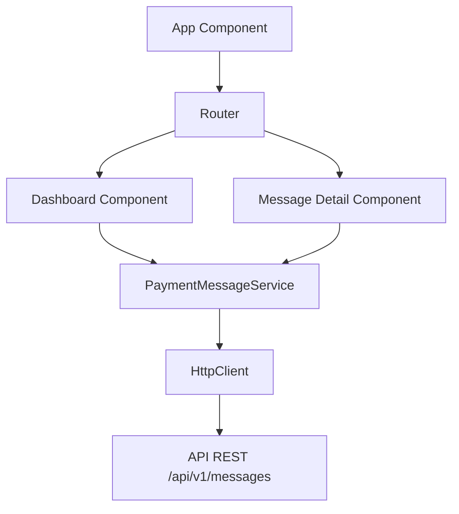

# Architecture Frontend

## 1. Présentation

Le frontend est une application **Angular 22** en **standalone components** (sans NgModule).

> **Note :** Le frontend est actuellement en phase initiale de développement. Seul le scaffold Angular CLI est présent. Les fonctionnalités métier (dashboard, recherche, détail) sont à implémenter.

---

## 2. Stack technique

| Technologie | Version | Rôle |
|---|---|---|
| Angular | 22 | Framework |
| TypeScript | 6 | Langage |
| RxJS | 7.8 | Programmation réactive |
| Vitest | 4 | Tests unitaires |
| Prettier | 3.8 | Formateur de code |
| SCSS | - | Préprocesseur CSS |

---

## 3. Structure actuelle

```
frontend/src/
├── index.html                 # Point d'entrée HTML
├── main.ts                    # Bootstrap Angular
├── styles.scss                # Styles globaux (vide)
└── app/
    ├── app.ts                 # Composant racine
    ├── app.html               # Template racine
    ├── app.scss               # Styles du composant racine
    ├── app.config.ts          # Configuration (providers, router)
    ├── app.routes.ts          # Configuration des routes (vide)
    └── app.spec.ts            # Tests du composant racine
```

---

## 4. État d'avancement

### 4.1 Implémenté

- ✅ Scaffold Angular 22 standalone
- ✅ Composant racine `App`
- ✅ Configuration du routeur (prêt à recevoir des routes)
- ✅ Configuration des providers
- ✅ Tests de base (création du composant, rendu)

### 4.2 À implémenter

- ❌ **Services HTTP** : appel à l'API REST `/api/v1/messages`
- ❌ **Modèles** : interfaces TypeScript (`PaymentMessage`, `PaymentMessageStatus`)
- ❌ **Dashboard** : liste paginée des messages avec filtres (statut, date)
- ❌ **Détail** : consultation d'un message individuel
- ❌ **Recherche** : filtrage par référence, messageId
- ❌ **Environnements** : configuration `environment.ts` (URL API)
- ❌ **Composants** : structure de dossiers dédiée

---

## 5. Architecture cible



### 5.1 Modules et fonctionnalités prévues

| Module | Composants | Rôle |
|---|---|---|
| Core | `PaymentMessageService`, Modèles | Services HTTP, interfaces |
| Dashboard | `MessageListComponent`, `FilterBarComponent` | Liste paginée, filtres |
| Detail | `MessageDetailComponent` | Vue détaillée d'un message |

### 5.2 Endpoints consommés

| Méthode | Path | Usage |
|---|---|---|
| `GET` | `/api/v1/messages` | Liste paginée avec filtres |
| `GET` | `/api/v1/messages/stats` | Statistiques par statut |
| `GET` | `/api/v1/messages/{id}` | Détail d'un message |
| `DELETE` | `/api/v1/messages/{id}` | Suppression |
| `POST` | `/api/v1/messages/batch/retry-failed` | Retry batch |
| `POST` | `/api/v1/messages/{id}/retry` | Retry individuel |
| `PUT` | `/api/v1/messages/{id}/status` | Mise à jour statut |
