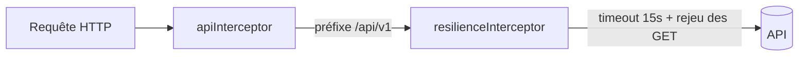

# Architecture Frontend

## 1. Présentation

Le frontend est une application **Angular 22** en **standalone components** (sans NgModule),
routes entièrement paresseuses (`loadComponent`), état en **signaux**, mode *zoneless*.

---

## 2. Stack technique

| Technologie | Version | Rôle |
|---|---|---|
| Angular | 22 | Framework |
| TypeScript | 6 | Langage |
| RxJS | 7.8 | Programmation réactive |
| Angular Material + CDK | 22 | Dialogues, snackbar, sélecteurs |
| Vitest | 4 | Tests unitaires |
| Prettier | 3.8 | Formateur de code |
| SCSS | - | Préprocesseur CSS |

---

## 3. Structure

```
frontend/src/
├── main.ts                        # Bootstrap Angular
├── styles/_tokens.scss            # Design tokens (couleurs, espacements, polices)
└── app/
    ├── app.ts                     # Racine : rend le gabarit applicatif
    ├── app.config.ts              # Providers (router, HttpClient + intercepteurs, Material)
    ├── app.routes.ts              # Routes paresseuses (loadComponent)
    ├── core/                      # Singletons applicatifs
    │   ├── config/api.config.ts             # Chemins d'API
    │   ├── interceptors/api.interceptor.ts  # Préfixe /api/v1
    │   ├── interceptors/resilience.interceptor.ts # Délai maximal + rejeu des GET
    │   └── services/                        # NotificationService, ThemeService
    ├── features/
    │   ├── messages/                        # Domaine : pages, composants, service, modèles
    │   └── simulation/                      # Dépôt de messages de test sur IBM MQ
    ├── layout/                              # header / sidebar / main-layout
    └── shared/                              # status-badge, ui/icon, kpi-card, config, pipes
```

---

## 4. Accès à l'API

**L'authentification et les autorisations sont hors périmètre du sujet** : l'application ne
gère ni session, ni jeton, ni rôle. Aucun écran de connexion, aucun garde de route, aucun
en-tête `Authorization` — le gabarit applicatif est rendu directement au démarrage.

Deux intercepteurs seulement restent sur le chemin des requêtes :


```mermaid
flowchart LR
    REQ[Requête HTTP] --> API_I[apiInterceptor]
    API_I -->|préfixe /api/v1| RES_I[resilienceInterceptor]
    RES_I -->|timeout 15s + rejeu des GET| API[(API)]
```

- **`apiInterceptor`** préfixe toute URL commençant par `/api` avec `API_CONFIG.baseUrl`.
- **`resilienceInterceptor`** ferme la marche : délai maximal de 15 s et deux rejeux à
  repli exponentiel, **sur `GET`/`HEAD` uniquement** — rejouer un `POST /retry` ou un
  `DELETE` doublerait l'effet métier.

---

## 5. Endpoints consommés

| Méthode | Path | Usage |
|---|---|---|
| `GET` | `/api/v1/messages` | Liste paginée avec filtres (statut, date, type, recherche) |
| `GET` | `/api/v1/messages/stats` | Compteurs par statut sous les filtres actifs |
| `GET` | `/api/v1/messages/stats/dashboard` | Agrégats du dashboard (volume horaire, types, tentatives, alertes) |
| `GET` | `/api/v1/messages/types` | Types présents en base (sélecteur de la barre de filtres) |
| `GET` | `/api/v1/messages/{id}` | Détail d'un message (payload inclus) |
| `GET` | `/api/v1/config` | Configuration MQ non sensible |
| `GET` | `/api/v1/simulation/config` | File visée et bornes de la simulation d'envoi |
| `GET` | `/api/v1/simulation/sends/{taskId}` | Avancement d'un envoi de test |
| `DELETE` | `/api/v1/messages/{id}` | Suppression |
| `POST` | `/api/v1/messages/batch/retry-failed` | Rejeu massif, suivi par `taskId` |
| `POST` | `/api/v1/messages/{id}/retry` | Rejeu individuel |
| `POST` | `/api/v1/simulation/sends` | Dépôt de messages de test, suivi par `taskId` |
| `PUT` | `/api/v1/messages/{id}/status` | Changement de statut (`ADMIN`), corps `{ status, reason }` |

Le sélecteur de statut ne propose que les transitions autorisées (`STATUS_TRANSITIONS` dans
`shared/config/status.config.ts`, recopie de la machine à états du serveur) et recueille un
motif facultatif. Le serveur reste l'autorité : une transition interdite répond `422`, dont le
`detail` est affiché tel quel.

---

## 6. Données et réactivité

- **Aucun filtre client.** Statut, date, type et recherche texte partent au serveur, et les
  compteurs des pastilles sont calculés sous les mêmes critères : une pastille annonce ce que
  donnerait un clic dessus. Filtrer la page affichée pendant que les compteurs portaient sur
  toute la table affichait « FAILED 1 240 » puis trois lignes.
- **Anti-rebond de 250 ms** sur la recherche : une requête par saisie, pas une par frappe.
- **Le dashboard ne télécharge plus d'échantillon.** Deux appels (`/stats` et
  `/stats/dashboard`) remplacent le rapatriement de 200 messages complets dont le client
  recomptait tout : les chiffres portent sur la table entière au lieu d'un échantillon non
  représentatif.
- **Requêtes concurrentes annulées.** Chaque flux (liste, compteurs, agrégats) passe par un
  `Subject` consommé en `switchMap` dans `MessageService` : la requête en vol est annulée dès
  que la suivante part, donc c'est la dernière page *demandée* qui s'affiche, et non la
  dernière *arrivée*.
- **Rafraîchissement périodique** toutes les 30 s (`AUTO_REFRESH_MS`), suspendu quand l'onglet
  est masqué (`visibilityState`) et rattrapé au retour. La pastille du bandeau le pilote et
  indique quand l'écran est volontairement figé ; seules les vues déjà chargées sont rejouées.
  Un rafraîchissement de fond ne repasse pas la vue en squelette.
- **Tableau ou cartes, jamais les deux.** Le rendu est conditionné par un signal de point de
  rupture (`BreakpointObserver`, `max-width: 700px`) au lieu d'être masqué en CSS, et la
  taille formatée de chaque ligne est mémorisée dans un modèle de ligne.
- **Lectures unitaires en `httpResource`.** Le message affiché (`/messages/{id}`), la liste des
  types et la configuration MQ sont décrits en fonction d'un signal : Angular émet la requête,
  annule la précédente et expose `isLoading()` / `error()`. Une description `undefined` laisse
  la ressource au repos — c'est ce qui remplace les gardes « déjà chargé ». Les `subscribe`
  restants sont des **commandes** (`POST`, `PUT`, `DELETE`) et le suivi du rejeu massif.
- **Détection de changement `OnPush`** sur tous les composants : en mode *zoneless*, un cycle
  parcourt sinon les vues non `OnPush` alors qu'un seul signal a changé.

---

## 7. Résilience et chargement

- **`resilienceInterceptor`** (en bout de chaîne, donc sur la requête définitive) : délai
  maximal de 15 s sur toutes les méthodes, et rejeu avec temporisation exponentielle
  (300 ms puis 600 ms, deux reprises) **limité aux méthodes idempotentes** — rejouer un
  `POST /retry` doublerait l'effet métier. Seuls un `status 0` (coupure réseau) et les `5xx`
  sont rejoués : un `4xx` renverrait la même réponse, et un dépassement de délai rejoué trois
  fois enchaînerait 45 s d'attente.
- **`withFetch()`** : l'API `fetch` remplace `XMLHttpRequest`, ce qui annule réellement la
  requête (et non le seul abonnement) quand un `switchMap` ou une ressource abandonne.
- **Pas de moteur d'animations.** Toutes les animations sont en CSS et Angular Material 22
  n'importe plus `@angular/animations` : `provideAnimations()` et la dépendance sont retirés
  plutôt que chargés en différé (`provideAnimationsAsync()` est déprécié depuis la 20.2).
- **`@defer`** sur les blocs sous la ligne de flottaison du dashboard (`on viewport`, avec un
  substitut qui réserve la hauteur) et sur le tiroir de détail (`when`), sorti du lot de la
  page de liste avec la directive d'animation de liste qu'il embarque.
- **Budgets de build** (`angular.json`) : `initial` et `allScript`, ce dernier couvrant la
  somme des lots différés — sans lui, une régression de poids passait inaperçue dès qu'elle
  tombait dans un *chunk* paresseux.

---

## 8. Simulation d'envoi

Route `/simulation`, lot paresseux dédié. L'écran dépose des messages de test sur une file
IBM MQ, dans le rôle que tiennent les applications de back-office du flux réel.

**Rien n'est court-circuité.** Le payload part tel quel sur la file et repasse par le
consommateur applicatif : même désérialisation, même validation, mêmes rejets. C'est ce qui
rend l'écran utile — un message y devient une ligne `RECEIVED` (ou `FAILED` si le payload est
invalide) exactement comme un message venu d'un vrai producteur.

- **Le serveur cadence, le client interroge.** `POST /simulation/sends` répond `202` avec un
  `taskId` ; l'avancement est relu toutes les 500 ms jusqu'à l'état terminal. L'IHM ne compte
  rien elle-même : deux onglets ouverts voient le même envoi, et un rechargement de page n'en
  invente pas un second.
- **La file de destination est affichée, jamais choisie.** L'API ne prend pas de destination en
  paramètre : les messages partent sur la file configurée, que `GET /simulation/config` expose
  pour affichage. Le champ correspondant est un encart en lecture seule, pas un `<select>` —
  proposer un choix inexistant serait mentir sur ce que fait le bouton. Le nom affiché vient de
  `SimulationService.queue()`, qui replie sur la configuration MQ (`GET /config`, déjà chargée
  par le bandeau latéral) : les deux exposent la même propriété serveur (`ibm.mq.queue`), et le
  repli garde le champ lisible tant que la configuration de simulation n'a pas répondu.
- **Les bornes viennent du serveur** (même endpoint) : plafond du nombre de messages et de la
  cadence. Le formulaire s'y ajuste, mais c'est le serveur qui refuse — une borne recopiée en
  dur aurait dérivé au premier changement de configuration.
- **Les compteurs disent « publiés », pas « traités ».** Ils mesurent l'acceptation par le
  broker ; le sort applicatif se lit dans l'onglet Messages, et l'écran renvoie vers lui plutôt
  que d'afficher un succès qu'il ne peut pas constater.
- **Modèles de payload** (`features/simulation/config/templates.ts`) écrits sur le contrat de
  la file d'entrée (`PaymentMessageEvent`), **pas** sur celui de l'API REST : `executionDate`
  y est une `LocalDate` et `createdAt` une `LocalDateTime` **sans décalage horaire**, à
  l'inverse des horodatages de l'API. Deux modèles sont invalides à dessein et couvrent les
  deux chemins de rejet définitif — JSON illisible et validation en échec.
- **`uniqueIds` est cochée par défaut** : l'ingestion est idempotente sur `messageId`, sans
  réécriture un envoi en masse ne produirait qu'une seule ligne. La case reste décochable,
  c'est justement de quoi tester la déduplication.
- **L'historique est celui de l'onglet**, pas un journal : le serveur ne retient que les
  derniers envois, le temps d'en suivre l'avancement. L'en-tête de la carte le dit.
- **Écran coupable par configuration.** Quand `app.simulation.enabled` est `false`, l'API
  répond `503` et l'écran affiche un bandeau — il ne prétend pas fonctionner à vide.
