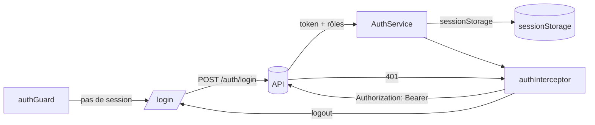

# Architecture Frontend

## 1. Présentation

Le frontend est une application **Angular 22** en **standalone components** (sans NgModule),
routes entièrement paresseuses (`loadComponent`), état en **signaux**, mode *zoneless*.

---

## 2. Stack technique

| Technologie | Version | Rôle |
|---|---|---|
| Angular | 22 | Framework |
| TypeScript | 6 | Langage |
| RxJS | 7.8 | Programmation réactive |
| Angular Material + CDK | 22 | Dialogues, snackbar, sélecteurs |
| Vitest | 4 | Tests unitaires |
| Prettier | 3.8 | Formateur de code |
| SCSS | - | Préprocesseur CSS |

---

## 3. Structure

```
frontend/src/
├── main.ts                        # Bootstrap Angular
├── styles/_tokens.scss            # Design tokens (couleurs, espacements, polices)
└── app/
    ├── app.ts                     # Racine : gabarit applicatif si session, sinon router-outlet
    ├── app.config.ts              # Providers (router, HttpClient + intercepteurs, Material)
    ├── app.routes.ts              # Routes paresseuses, protégées par authGuard
    ├── core/                      # Singletons applicatifs
    │   ├── auth/auth.service.ts             # Session : jeton, identité, rôles (signaux)
    │   ├── config/api.config.ts             # Chemins d'API
    │   ├── guards/auth.guard.ts             # Redirection vers /login sans session
    │   ├── interceptors/api.interceptor.ts  # Préfixe /api/v1
    │   ├── interceptors/auth.interceptor.ts # Jeton Bearer + traitement centralisé des 401
    │   └── services/                        # NotificationService, ThemeService
    ├── features/
    │   ├── auth/login.page.ts               # Écran de connexion
    │   └── messages/                        # Domaine : pages, composants, service, modèles
    ├── layout/                              # header / sidebar / main-layout
    └── shared/                              # status-badge, ui/icon, kpi-card, config, pipes
```

---

## 4. Session et sécurité

L'API est fermée : sans jeton, toutes les requêtes répondent `401`. La chaîne côté client :


```mermaid
flowchart LR
    GUARD[authGuard] -->|pas de session| LOGIN[/login/]
    LOGIN -->|POST /auth/login| API[(API)]
    API -->|token + rôles| AUTH[AuthService]
    AUTH -->|sessionStorage| STORE[(sessionStorage)]
    AUTH --> INTERCEPT[authInterceptor]
    INTERCEPT -->|Authorization: Bearer| API
    API -->|401| INTERCEPT
    INTERCEPT -->|logout| LOGIN
```

- **`AuthService`** conserve jeton, identité et rôles en signaux, persistés dans
  `sessionStorage` — et non `localStorage` : la session disparaît à la fermeture de l'onglet,
  ce qui réduit la fenêtre d'exploitation en cas de XSS.
- **`authInterceptor`** pose l'en-tête `Authorization` sur les appels API (sauf
  l'authentification) et traite le `401` en un seul endroit : session fermée, redirection vers
  `/login`. Un `403` ne ferme pas la session, c'est un défaut de rôle.
- **`authGuard`** évite d'ouvrir une vue qui ne pourrait rien charger, et mémorise l'URL
  demandée (`returnUrl`).
- Hors session, `app.ts` rend la page de connexion **seule** : le gabarit (barre latérale,
  bandeau, bouton d'actualisation) n'aurait rien à afficher.
- Le bandeau affiche le compte connecté, ses rôles en infobulle, et un bouton de déconnexion.
- Les opérations réservées à `ADMIN` (suppression, changement de statut, rejeu massif)
  restent visibles : un `403` est signalé par un message explicite plutôt que masqué.

---

## 5. Endpoints consommés

| Méthode | Path | Usage |
|---|---|---|
| `POST` | `/api/v1/auth/login` | Obtention du jeton |
| `GET` | `/api/v1/messages` | Liste paginée avec filtres |
| `GET` | `/api/v1/messages/stats` | Statistiques par statut |
| `GET` | `/api/v1/messages/{id}` | Détail d'un message (payload inclus) |
| `GET` | `/api/v1/config` | Configuration MQ non sensible |
| `DELETE` | `/api/v1/messages/{id}` | Suppression (`ADMIN`) |
| `POST` | `/api/v1/messages/batch/retry-failed` | Rejeu massif (`ADMIN`), suivi par `taskId` |
| `POST` | `/api/v1/messages/{id}/retry` | Rejeu individuel |
| `PUT` | `/api/v1/messages/{id}/status` | Changement de statut (`ADMIN`), corps `{ status, reason }` |

Le sélecteur de statut ne propose que les transitions autorisées (`STATUS_TRANSITIONS` dans
`shared/config/status.config.ts`, recopie de la machine à états du serveur) et recueille un
motif facultatif. Le serveur reste l'autorité : une transition interdite répond `422`, dont le
`detail` est affiché tel quel.
