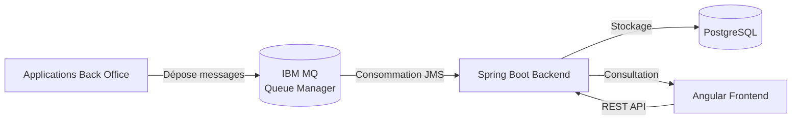

# Architecture Overview

## 1. Introduction

L'application **Payment Messages** est une application web permettant de récupérer, stocker et consulter des messages de paiement transitant via IBM MQ.

Elle intervient dans la chaîne de traitement des paiements entre les applications Back Office et les systèmes de routage bancaire.

Les objectifs principaux sont :

- récupérer les messages depuis IBM MQ ;
- assurer la persistance des messages ;
- permettre leur consultation via une interface web ;
- garantir performance, résilience et traçabilité.

---

# 2. Architecture globale

