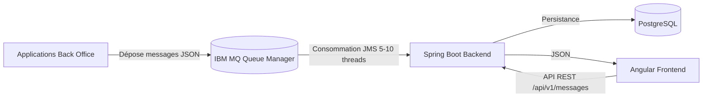
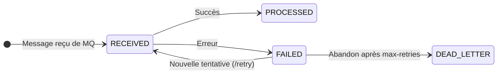
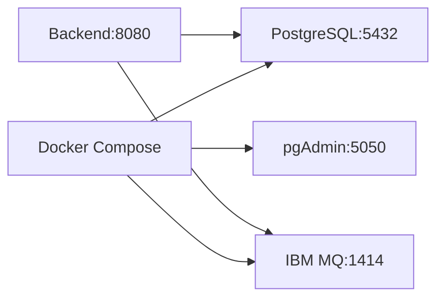

# Architecture Overview

## 1. Introduction

L'application **Payment Messages** est une application web permettant de récupérer, stocker et consulter des messages de paiement transitant via IBM MQ.

Elle intervient dans la chaîne de traitement des paiements entre les applications Back Office et les systèmes de routage bancaire.

Les objectifs principaux sont :

- récupérer les messages depuis IBM MQ ;
- assurer la persistance des messages ;
- permettre leur consultation via une interface web ;
- garantir performance, résilience et traçabilité.

---

## 2. Architecture globale

### Flux principal

1. Les applications **Back Office** déposent des messages JSON dans une file **IBM MQ**
2. Le **Spring Boot Backend** consomme ces messages via un listener JMS (5-10 threads concurrents)
3. Chaque message est désérialisé, validé, puis persisté dans **PostgreSQL**
4. Les messages sont exposés via une **API REST** paginée
5. Le **Frontend Angular** consomme l'API pour afficher et gérer les messages

---

## 3. Cycle de vie des messages

Le cycle de vie complet (4 statuts) et les transitions détaillées sont documentés dans [flux.md](./flux.md).

---

## 4. API REST

Base path : `/api/v1/messages`

| Méthode | Path | Action |
|---|---|---|
| `GET` | `/api/v1/messages` | Liste paginée avec filtres (statut, date) |
| `GET` | `/api/v1/messages/stats` | Statistiques par statut |
| `GET` | `/api/v1/messages/{id}` | Détail d'un message |
| `DELETE` | `/api/v1/messages/{id}` | Suppression |
| `POST` | `/api/v1/messages/batch/retry-failed` | Relance des messages en échec |
| `POST` | `/api/v1/messages/{id}/retry` | Relance individuelle |
| `PUT` | `/api/v1/messages/{id}/status` | Mise à jour du statut |

Swagger UI : `http://localhost:8080/swagger-ui.html`

Documentation complète : [docs/api/api-documentation.md](../api/api-documentation.md)

---

## 5. Stack technique

### Backend

| Technologie | Version |
|---|---|
| Java | 21 |
| Spring Boot | 4.1.0 |
| Spring Data JPA | - |
| Spring JMS | - |
| IBM MQ Client | 9.4.2.0 |
| PostgreSQL | 18 |
| H2 (tests) | - |
| Lombok | - |
| Jackson | - |
| SpringDoc OpenAPI | 2.8.9 |
| Spring Boot Actuator | - |

### Frontend

| Technologie | Version |
|---|---|
| Angular | 22 |
| TypeScript | 6 |
| RxJS | 7.8 |
| Vitest | 4 |

### Infrastructure

| Technologie | Version |
|---|---|
| Docker | - |
| Docker Compose | - |

---

## 6. Déploiement

Documentation détaillée :

- [Architecture backend](./architecture-backend.md)
- [Architecture frontend](./architecture-frontend.md)
- [Flux de données](./flux.md)
- [Modèle de données](../database/database-model.md)
- [Configuration IBM MQ](../ibm-mq/ibm-mq-configuration.md)
- [API REST](../api/api-documentation.md)
