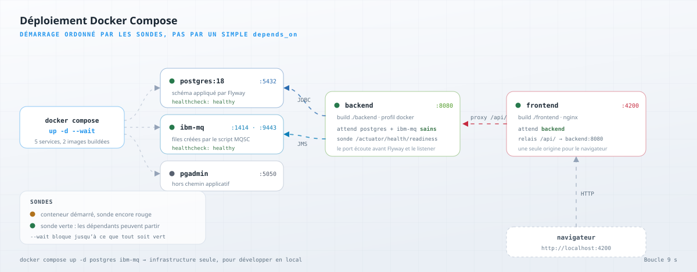

# Architecture globale

Application web de collecte, stockage et consultation des messages de paiement transitant par
IBM MQ. Elle s'insère entre les applications Back Office et les systèmes de routage bancaire, avec
quatre exigences : performance, résilience, traçabilité, supervision.

---

## 1. Vue d'ensemble

  

| Étape | Composant | Point clé |
|---|---|---|
| Dépôt | Back Office | message JSON sur `PAYMENT.REQUEST.QUEUE` |
| Consommation | `PaymentMessageListener` | 5-10 consommateurs, session transactée |
| Persistance | `PaymentMessageService` | idempotente sur `messageId` |
| Exposition | `/api/v1/messages` | pagination, filtres serveur, agrégats SQL |
| Consultation | IHM Angular | signals, requêtes annulables, rafraîchissement 30 s |

---

## 2. Cycle de vie des messages

  

Le graphe est **appliqué par le serveur** (`PaymentMessageStatus.canTransitionTo`) : toute autre
transition répond `422`. Détail des déclencheurs : [flux.md](./flux.md#2-cycle-de-vie-dun-message).

---

## 3. API REST

Tous les endpoints sont ouverts — **l'authentification et les autorisations sont hors périmètre du
sujet**. Erreurs au format `application/problem+json` (RFC 9457) avec un `correlationId` repris de
`X-Request-Id`.

- Contrat complet : [api-documentation.md](../api/api-documentation.md)
- Swagger UI : `http://localhost:8080/swagger-ui.html`

---

## 4. Déploiement

  

`docker compose up -d` construit les **deux** images applicatives depuis leurs `Dockerfile`. Le port
8080 écoute bien avant que Flyway, le pool JDBC et le conteneur d'écoute JMS soient prêts : c'est
`/actuator/health/readiness` qui fait foi, et `--wait` s'y adosse.

---

## 5. Voir aussi

| Sujet | Fichier |
|---|---|
| Flux de données détaillés | [flux.md](./flux.md) |
| Architecture backend | [architecture-backend.md](./architecture-backend.md) |
| Architecture frontend | [architecture-frontend.md](./architecture-frontend.md) |
| Modèle de données | [../database/database-model.md](../database/database-model.md) |
| Configuration IBM MQ | [../ibm-mq/ibm-mq-configuration.md](../ibm-mq/ibm-mq-configuration.md) |
| API REST | [../api/api-documentation.md](../api/api-documentation.md) |
| Stack et versions | [../../README.md](../../README.md) |
