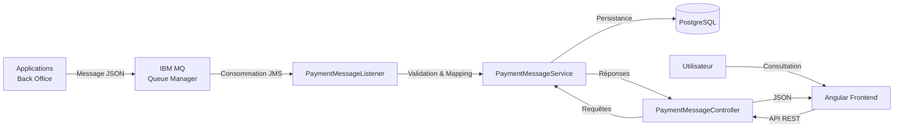
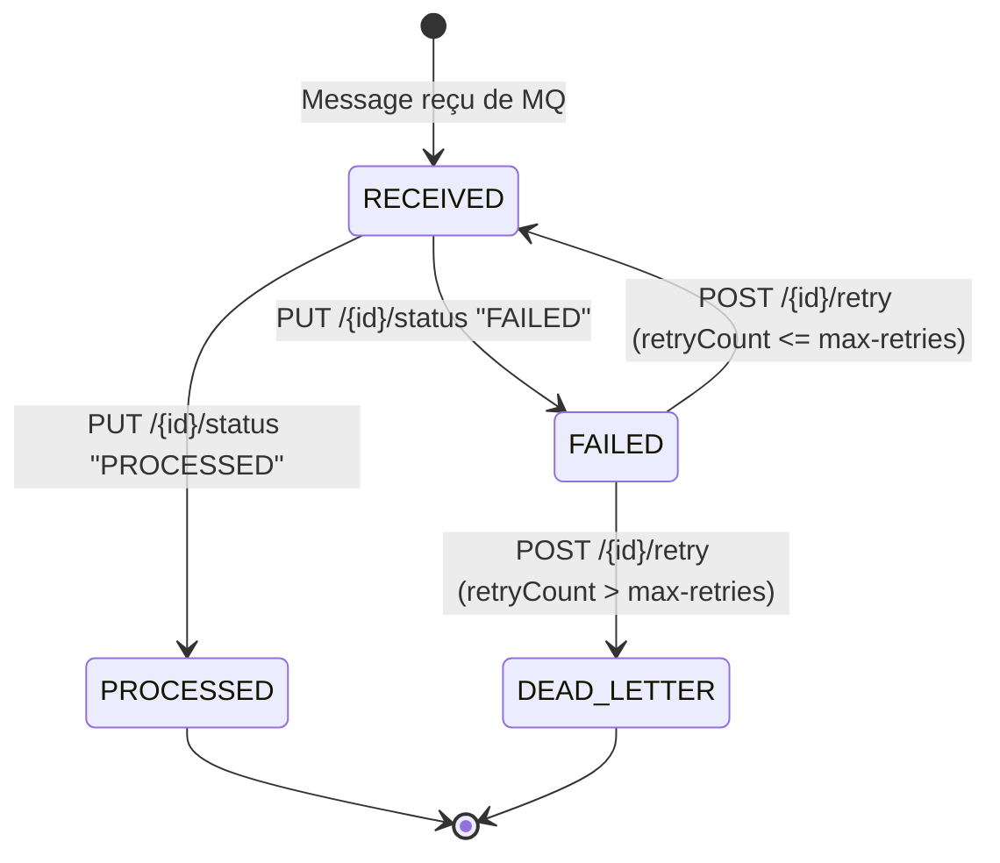
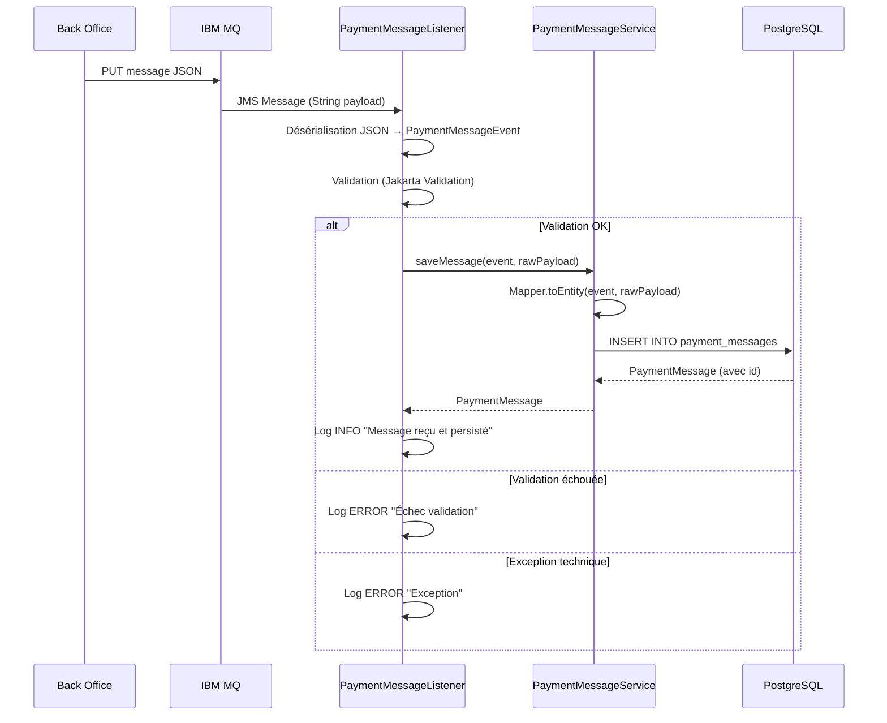
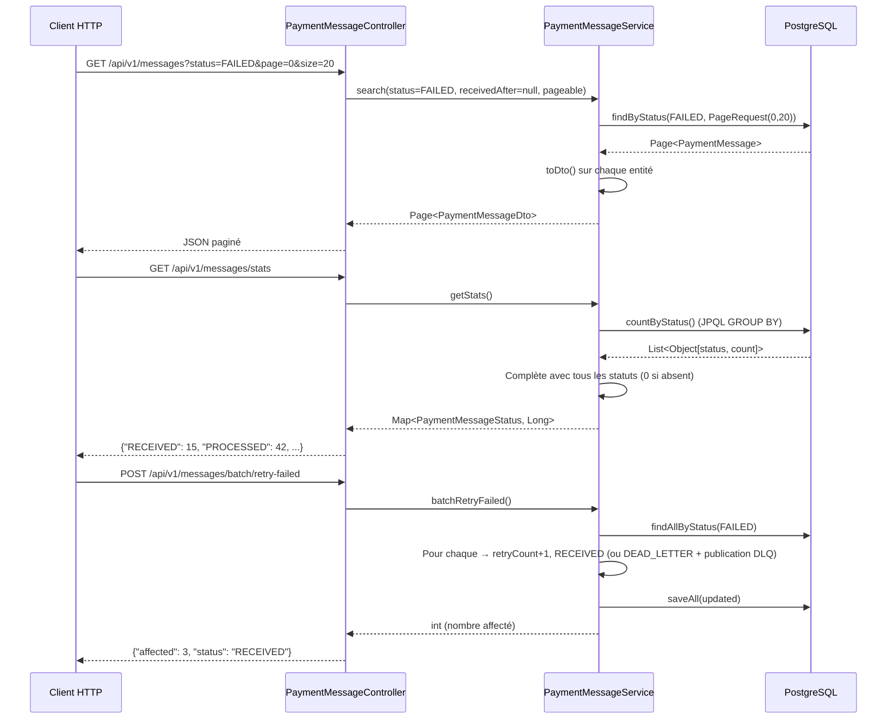
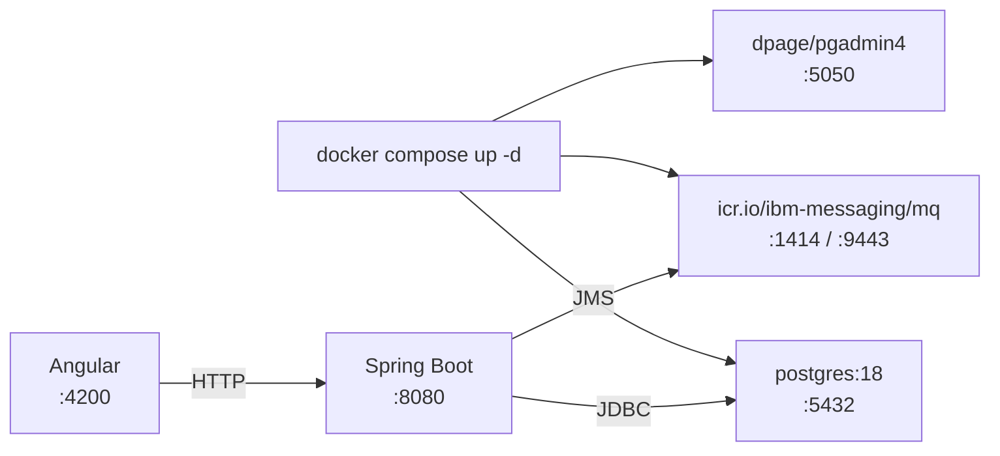

# Flux de données

## 1. Vue d'ensemble

---

## 2. Cycle de vie d'un message

### États

| Statut | Description |
|---|---|
| `RECEIVED` | Message reçu de la file MQ et persisté, en attente de traitement |
| `PROCESSED` | Traitement terminé avec succès (état terminal) |
| `FAILED` | Erreur technique ou métier, rejouable via `/retry` |
| `DEAD_LETTER` | Abandonné après `ibm.mq.max-retries` tentatives, payload republié sur la DLQ (état terminal) |

> Aucune transition n'est automatique : le listener ne pose que l'état initial `RECEIVED`.
> `PROCESSED` et `FAILED` sont pilotés par `PUT /{id}/status`, `RECEIVED`/`DEAD_LETTER` par `/retry`.

---

## 3. Flux détaillé : consommation MQ

---

## 4. Flux détaillé : API REST

---

## 5. Flux Docker Compose

### Services

| Service | Image | Ports | Dépend |
|---|---|---|---|
| PostgreSQL | postgres:18 | 5432 | - |
| pgAdmin | dpage/pgadmin4 | 5050 | postgres |
| IBM MQ | icr.io/ibm-messaging/mq | 1414, 9443 | - |
| Backend | build local | 8080 | postgres, ibm-mq |
| Frontend | build local | 4200 | backend |
