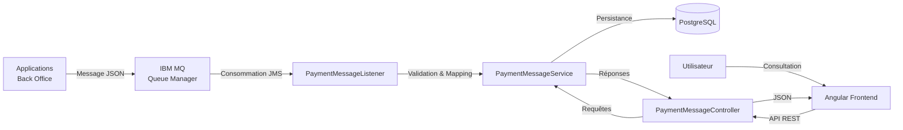
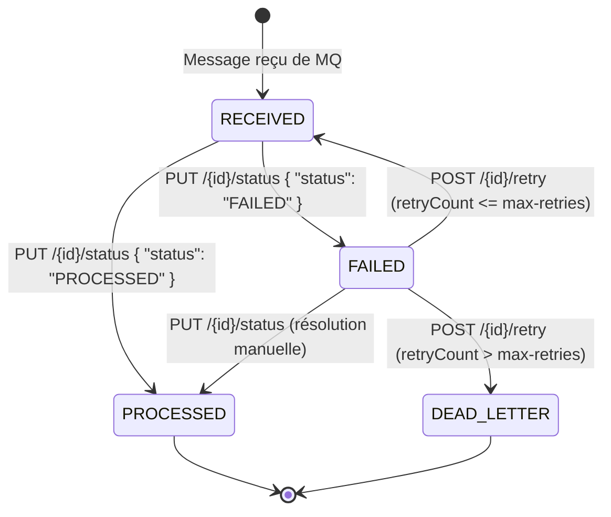
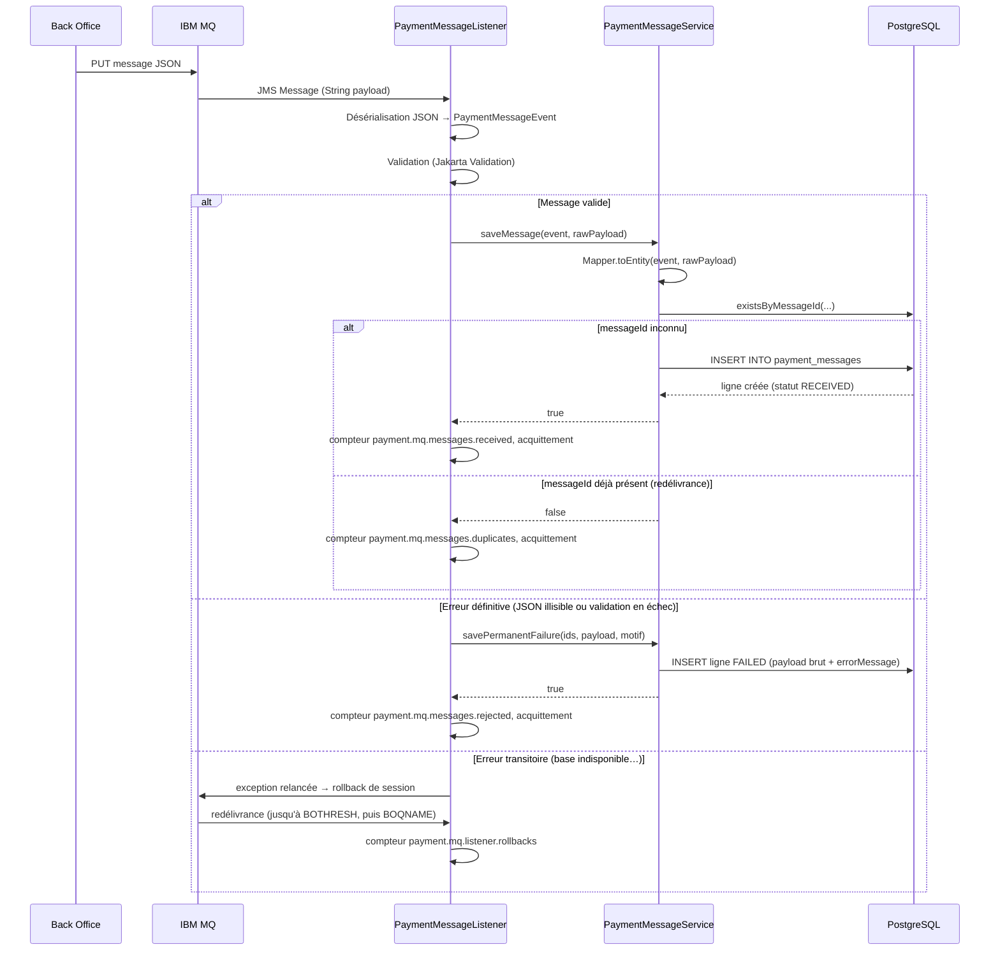
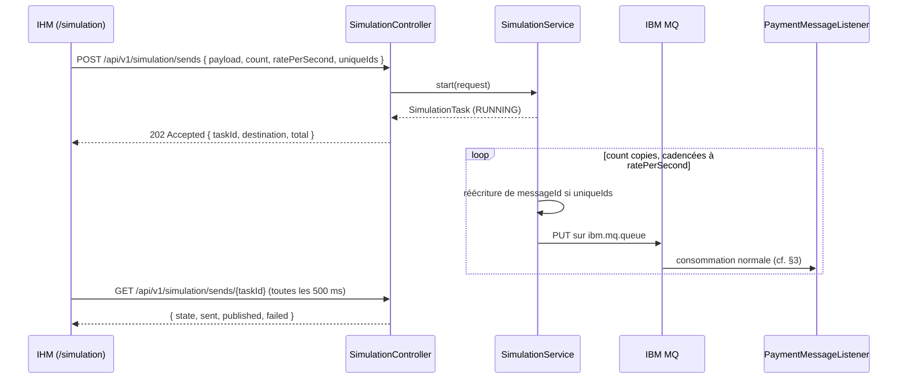
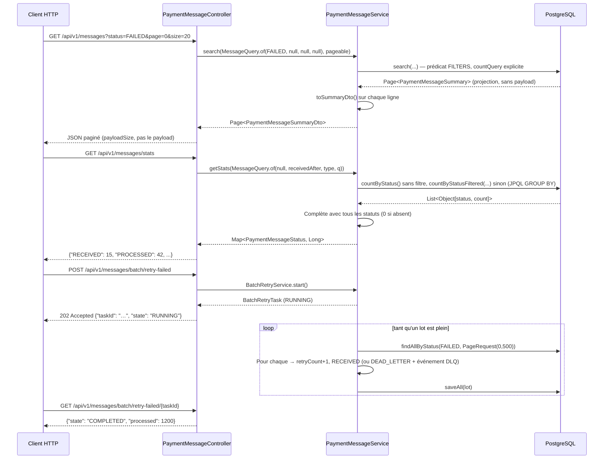
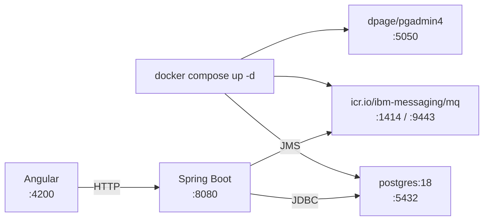

# Flux de données

## 1. Vue d'ensemble

```mermaid
flowchart LR
    BO[Applications<br/>Back Office] -->|Message JSON| MQ[IBM MQ<br/>Queue Manager]

    MQ -->|Consommation JMS| LISTENER[PaymentMessageListener]

    LISTENER -->|Validation & Mapping| SERVICE[PaymentMessageService]

    SERVICE -->|Persistance| DB[(PostgreSQL)]

    USER[Utilisateur] -->|Consultation| UI[Angular Frontend]
    UI -->|API REST| API[PaymentMessageController]
    API -->|Requêtes| SERVICE
    SERVICE -->|Réponses| API
    API -->|JSON| UI
```

> Rendu PNG : [flux-01-vue-ensemble.png](./flux-01-vue-ensemble.png)

---

## 2. Cycle de vie d'un message

```mermaid
stateDiagram-v2
    [*] --> RECEIVED: Message reçu de MQ
    RECEIVED --> PROCESSED: PUT /{id}/status { "status": "PROCESSED" }
    RECEIVED --> FAILED: PUT /{id}/status { "status": "FAILED" }
    FAILED --> RECEIVED: POST /{id}/retry (retryCount <= max-retries)
    FAILED --> PROCESSED: PUT /{id}/status (résolution manuelle)
    FAILED --> DEAD_LETTER: POST /{id}/retry (retryCount > max-retries)
    PROCESSED --> [*]
    DEAD_LETTER --> [*]
```

> Rendu PNG : [flux-02-cycle-de-vie.png](./flux-02-cycle-de-vie.png)

### États

| Statut | Description |
|---|---|
| `RECEIVED` | Message reçu de la file MQ et persisté, en attente de traitement |
| `PROCESSED` | Traitement terminé avec succès (état terminal) |
| `FAILED` | Erreur technique ou métier, rejouable via `/retry` |
| `DEAD_LETTER` | Abandonné après `ibm.mq.max-retries` tentatives, payload republié sur la DLQ (état terminal) |

> Aucune transition n'est automatique : le listener ne pose que l'état initial `RECEIVED`.
> `PROCESSED` et `FAILED` sont pilotés par `PUT /{id}/status`, `RECEIVED`/`DEAD_LETTER` par `/retry`.
>
> Ce graphe est **appliqué** par le serveur : `PUT /{id}/status` confronte la demande à
> `PaymentMessageStatus.canTransitionTo(...)` et refuse toute autre transition en `422`
> (`RECEIVED → DEAD_LETTER` sans tentative, sortie d'un statut terminal…). Un statut identique
> à l'actuel est accepté sans effet. La reprise d'un `DEAD_LETTER` passe par la Dead Letter
> Queue, pas par un retour en base.

---

## 3. Flux détaillé : consommation MQ

La session JMS est **transactée** : c'est ce qui sépare les deux familles d'erreurs. Une erreur
**définitive** (JSON illisible, validation en échec) ne sera pas résolue par une redélivrance —
le message est persisté en `FAILED` avec son payload brut et son motif, puis acquitté : rien
n'est perdu, la ligne reste rejouable depuis l'API. Une erreur **transitoire** (base
indisponible) laisse l'exception remonter : la session effectue un rollback et le gestionnaire
de files redélivre, dans la limite de `BOTHRESH`/`BOQNAME`.

```mermaid
sequenceDiagram
    participant BO as Back Office
    participant MQ as IBM MQ
    participant Listener as PaymentMessageListener
    participant Service as PaymentMessageService
    participant DB as PostgreSQL

    BO->>MQ: PUT message JSON
    MQ->>Listener: JMS Message (String payload)
    Listener->>Listener: Désérialisation JSON → PaymentMessageEvent
    Listener->>Listener: Validation (Jakarta Validation)

    alt Message valide
        Listener->>Service: saveMessage(event, rawPayload)
        Service->>Service: Mapper.toEntity(event, rawPayload)
        Service->>DB: existsByMessageId(...)
        alt messageId inconnu
            Service->>DB: INSERT INTO payment_messages
            DB-->>Service: ligne créée (statut RECEIVED)
            Service-->>Listener: true
            Listener->>Listener: compteur payment.mq.messages.received, acquittement
        else messageId déjà présent (redélivrance)
            Service-->>Listener: false
            Listener->>Listener: compteur payment.mq.messages.duplicates, acquittement
        end
    else Erreur définitive (JSON illisible ou validation en échec)
        Listener->>Service: savePermanentFailure(ids, payload, motif)
        Service->>DB: INSERT ligne FAILED (payload brut + errorMessage)
        Service-->>Listener: true
        Listener->>Listener: compteur payment.mq.messages.rejected, acquittement
    else Erreur transitoire (base indisponible…)
        Listener->>MQ: exception relancée → rollback de session
        MQ->>Listener: redélivrance (jusqu'à BOTHRESH, puis BOQNAME)
        Listener->>Listener: compteur payment.mq.listener.rollbacks
    end
```

> Rendu PNG : [flux-03-consommation-mq.png](./flux-03-consommation-mq.png)

L'ingestion est **idempotente sur `messageId`** : une redélivrance ne crée pas de doublon. Le
contrôle d'existence préalable ne suffit pas à lui seul — deux consommateurs concurrents
peuvent le passer tous les deux. C'est la contrainte d'unicité en base qui arbitre : la
`DataIntegrityViolationException` est interceptée, le message re-vérifié, et l'insertion
comptée comme un doublon plutôt que relancée. `saveMessage` s'exécute d'ailleurs en
`Propagation.NOT_SUPPORTED` pour que cette violation reste confinée à la transaction interne
de `repository.save`, sans empoisonner une transaction englobante.

Le chronomètre `payment.mq.processing` est étiqueté par issue (`persisted`, `duplicate`,
`rejected`, `error`).

---

## 3 bis. Flux détaillé : simulation d'envoi

L'onglet « Simulation d'envoi » tient le rôle du back-office : il **publie sur la file
d'entrée** et n'écrit rien en base. Le message revient donc par le flux ci-dessus, avec la même
désérialisation, la même validation et les mêmes rejets.

```mermaid
sequenceDiagram
    participant UI as IHM (/simulation)
    participant Ctrl as SimulationController
    participant Svc as SimulationService
    participant MQ as IBM MQ
    participant Listener as PaymentMessageListener

    UI->>Ctrl: POST /api/v1/simulation/sends { payload, count, ratePerSecond, uniqueIds }
    Ctrl->>Svc: start(request)
    Svc-->>Ctrl: SimulationTask (RUNNING)
    Ctrl-->>UI: 202 Accepted { taskId, destination, total }
    loop count copies, cadencées à ratePerSecond
        Svc->>Svc: réécriture de messageId si uniqueIds
        Svc->>MQ: PUT sur ibm.mq.queue
        MQ->>Listener: consommation normale (cf. §3)
    end
    UI->>Ctrl: GET /api/v1/simulation/sends/{taskId} (toutes les 500 ms)
    Ctrl-->>UI: { state, sent, published, failed }
```

> Rendu PNG : [flux-04-simulation-envoi.png](./flux-04-simulation-envoi.png)

Les compteurs de la tâche portent sur la **publication** (acceptation par le broker), pas sur
le traitement applicatif : le sort de chaque message se lit dans `GET /api/v1/messages`.

---

## 4. Flux détaillé : API REST

```mermaid
sequenceDiagram
    participant Client as Client HTTP
    participant Controller as PaymentMessageController
    participant Service as PaymentMessageService
    participant DB as PostgreSQL

    Client->>Controller: GET /api/v1/messages?status=FAILED&page=0&size=20
    Controller->>Service: search(MessageQuery.of(FAILED, null, null, null), pageable)
    Service->>DB: search(...) — prédicat FILTERS, countQuery explicite
    DB-->>Service: Page<PaymentMessageSummary> (projection, sans payload)
    Service->>Service: toSummaryDto() sur chaque ligne
    Service-->>Controller: Page<PaymentMessageSummaryDto>
    Controller-->>Client: JSON paginé (payloadSize, pas le payload)

    Client->>Controller: GET /api/v1/messages/stats
    Controller->>Service: getStats(MessageQuery.of(null, receivedAfter, type, q))
    Service->>DB: countByStatus() sans filtre, countByStatusFiltered(...) sinon (JPQL GROUP BY)
    DB-->>Service: List<Object[status, count]>
    Service->>Service: Complète avec tous les statuts (0 si absent)
    Service-->>Controller: Map<PaymentMessageStatus, Long>
    Controller-->>Client: {"RECEIVED": 15, "PROCESSED": 42, ...}

    Client->>Controller: POST /api/v1/messages/batch/retry-failed
    Controller->>Service: BatchRetryService.start()
    Service-->>Controller: BatchRetryTask (RUNNING)
    Controller-->>Client: 202 Accepted {"taskId": "…", "state": "RUNNING"}
    loop tant qu'un lot est plein
        Service->>DB: findAllByStatus(FAILED, PageRequest(0,500))
        Service->>Service: Pour chaque → retryCount+1, RECEIVED (ou DEAD_LETTER + événement DLQ)
        Service->>DB: saveAll(lot)
    end
    Client->>Controller: GET /api/v1/messages/batch/retry-failed/{taskId}
    Controller-->>Client: {"state": "COMPLETED", "processed": 1200}
```

> Rendu PNG : [flux-05-api-rest.png](./flux-05-api-rest.png)

---

## 5. Flux Docker Compose

```mermaid
flowchart LR
    COMPOSE[docker compose up -d] --> POSTGRES[postgres:18<br/>:5432]
    COMPOSE --> PGADMIN[dpage/pgadmin4<br/>:5050]
    COMPOSE --> IBM_MQ[icr.io/ibm-messaging/mq<br/>:1414 / :9443]

    BACKEND[Spring Boot<br/>:8080] -->|JDBC| POSTGRES
    BACKEND -->|JMS| IBM_MQ

    FRONTEND[Angular<br/>:4200] -->|HTTP| BACKEND
```

> Rendu PNG : [flux-06-docker-compose.png](./flux-06-docker-compose.png)

### Services

| Service | Image | Ports | Dépend |
|---|---|---|---|
| PostgreSQL | postgres:18 | 5432 | - |
| pgAdmin | dpage/pgadmin4 | 5050 | postgres |
| IBM MQ | icr.io/ibm-messaging/mq | 1414, 9443 | - |
| Backend | build local | 8080 | postgres, ibm-mq |
| Frontend | build local | 4200 | backend |
