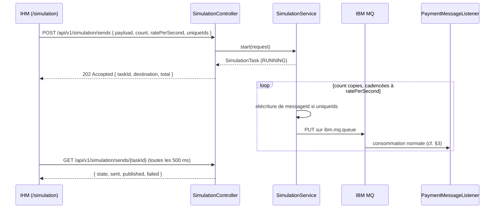
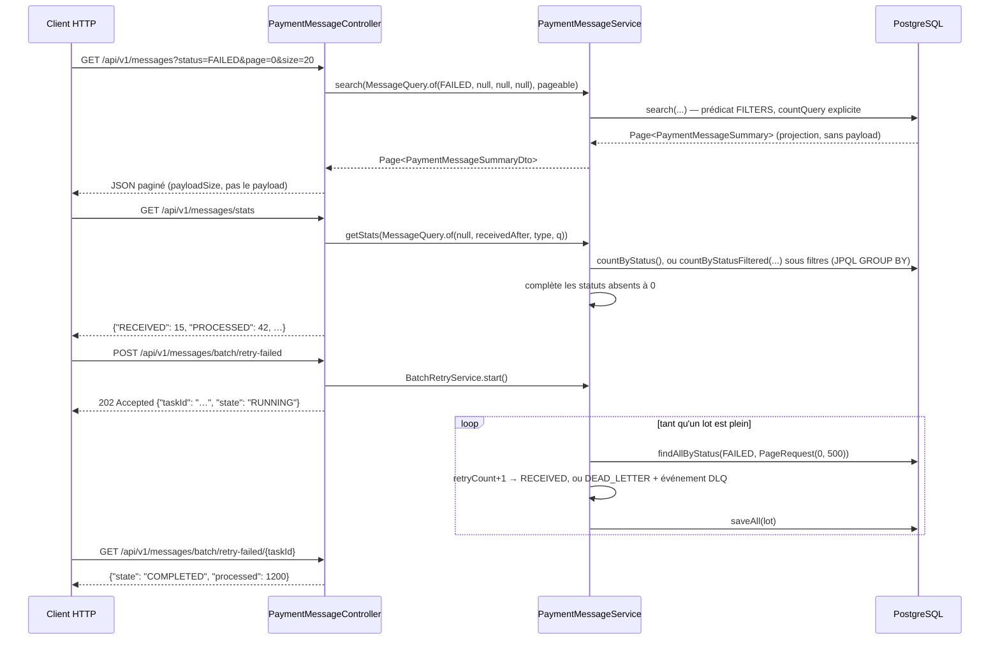

# Flux de données

## 1. Vue d'ensemble

  

---

## 2. Cycle de vie d'un message

  

| Statut | Description | Déclencheur |
|---|---|---|
| `RECEIVED` | Persisté, en attente de traitement | listener (seul état automatique) |
| `PROCESSED` | Traité avec succès — terminal | `PUT /{id}/status` |
| `FAILED` | Erreur technique ou métier, payload brut conservé | `PUT /{id}/status`, ou rejet définitif à l'ingestion |
| `DEAD_LETTER` | Abandonné après `ibm.mq.max-retries`, payload republié sur la DLQ — terminal | `POST /{id}/retry` |

Le serveur confronte chaque demande à `PaymentMessageStatus.canTransitionTo(...)` et refuse le reste
en `422` (`RECEIVED → DEAD_LETTER` sans tentative, sortie d'un statut terminal…). Un statut identique
à l'actuel est accepté sans effet. La reprise d'un `DEAD_LETTER` passe par la Dead Letter Queue, pas
par un retour en base.

---

## 3. Ingestion MQ

  

La session JMS **transactée** est ce qui sépare les deux familles d'erreurs. Une erreur
**définitive** (JSON illisible, validation en échec) ne serait pas résolue par une redélivrance : la
ligne est écrite en `FAILED` avec son motif, puis acquittée — rien n'est perdu, tout reste rejouable
depuis l'API. Une erreur **transitoire** (base indisponible) laisse remonter l'exception : rollback
de session, redélivrance par le gestionnaire de files dans la limite de `BOTHRESH`/`BOQNAME`.

Cette frontière ne tient que si le contrat refuse tout ce que la base refusera. La validation
descend donc dans le bloc `payment` (cascade `@Valid` — sans elle, un `payment: {}` ou un montant
négatif entrait en base) et borne `messageId`, `messageType` et `reference` à la longueur de leurs
colonnes, 255 caractères. Une valeur plus longue serait sinon acceptée puis cassée à l'`INSERT` :
une violation d'intégrité que rien ne distingue d'une panne, donc classée *transitoire*, donc
redélivrée en boucle. Symétriquement, `PaymentMessageMapper.toFailedEntity` tronque ces trois
identifiants — l'écriture d'un rejet ne doit pas pouvoir échouer sur ce qui a motivé le rejet.

L'idempotence est portée par la **contrainte d'unicité en base**, pas par le contrôle d'existence
préalable : deux consommateurs concurrents peuvent le passer tous les deux. La
`DataIntegrityViolationException` est interceptée, le message re-vérifié, et l'insertion comptée
comme doublon. `saveMessage` s'exécute en `Propagation.NOT_SUPPORTED` pour que cette violation reste
confinée à la transaction interne de `repository.save`.

---

## 4. Simulation d'envoi

L'onglet « Simulation d'envoi » tient le rôle du back-office : il **publie sur la file d'entrée** et
n'écrit rien en base. Le message revient donc par le flux du §3, avec la même désérialisation, la
même validation et les mêmes rejets.

```mermaid
sequenceDiagram
    participant UI as IHM (/simulation)
    participant Ctrl as SimulationController
    participant Svc as SimulationService
    participant MQ as IBM MQ
    participant Listener as PaymentMessageListener

    UI->>Ctrl: POST /api/v1/simulation/sends { payload, count, ratePerSecond, uniqueIds }
    Ctrl->>Svc: start(request)
    Svc-->>Ctrl: SimulationTask (RUNNING)
    Ctrl-->>UI: 202 Accepted { taskId, destination, total }
    loop count copies, cadencées à ratePerSecond
        Svc->>Svc: réécriture de messageId si uniqueIds
        Svc->>MQ: PUT sur ibm.mq.queue
        MQ->>Listener: consommation normale (cf. §3)
    end
    UI->>Ctrl: GET /api/v1/simulation/sends/{taskId} (toutes les 500 ms)
    Ctrl-->>UI: { state, sent, published, failed }
```

> Rendu PNG : [flux-04-simulation-envoi.png](./flux-04-simulation-envoi.png)

Les compteurs de la tâche portent sur la **publication** (acceptation par le broker), pas sur le
traitement applicatif : le sort de chaque message se lit dans `GET /api/v1/messages`.

---

## 5. API REST

```mermaid
sequenceDiagram
    participant Client as Client HTTP
    participant Controller as PaymentMessageController
    participant Service as PaymentMessageService
    participant DB as PostgreSQL

    Client->>Controller: GET /api/v1/messages?status=FAILED&page=0&size=20
    Controller->>Service: search(MessageQuery.of(FAILED, null, null, null), pageable)
    Service->>DB: search(...) — prédicat FILTERS, countQuery explicite
    DB-->>Service: Page<PaymentMessageSummary> (projection, sans payload)
    Service-->>Controller: Page<PaymentMessageSummaryDto>
    Controller-->>Client: JSON paginé (payloadSize, pas le payload)

    Client->>Controller: GET /api/v1/messages/stats
    Controller->>Service: getStats(MessageQuery.of(null, receivedAfter, type, q))
    Service->>DB: countByStatus(), ou countByStatusFiltered(...) sous filtres (JPQL GROUP BY)
    Service->>Service: complète les statuts absents à 0
    Controller-->>Client: {"RECEIVED": 15, "PROCESSED": 42, …}

    Client->>Controller: POST /api/v1/messages/batch/retry-failed
    Controller->>Service: BatchRetryService.start()
    Controller-->>Client: 202 Accepted {"taskId": "…", "state": "RUNNING"}
    loop tant qu'un lot est plein
        Service->>DB: findAllByStatus(FAILED, PageRequest(0, 500))
        Service->>Service: retryCount+1 → RECEIVED, ou DEAD_LETTER + événement DLQ
        Service->>DB: saveAll(lot)
    end
    Client->>Controller: GET /api/v1/messages/batch/retry-failed/{taskId}
    Controller-->>Client: {"state": "COMPLETED", "processed": 1200}
```

> Rendu PNG : [flux-05-api-rest.png](./flux-05-api-rest.png)

---

## 6. Docker Compose

  

