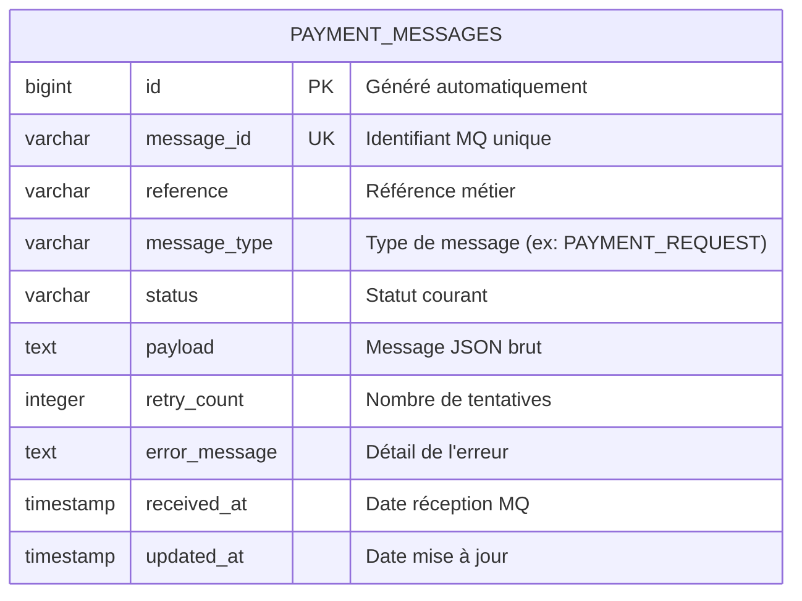

# Modèle de données

## 1. Schéma entité-relation



## 2. Table `payment_messages`

### 2.1 Colonnes

| Colonne | Type | Contraintes | Description |
|---|---|---|---|
| `id` | `BIGINT` | `PK`, `GENERATED BY DEFAULT AS IDENTITY` | Identifiant technique auto-généré |
| `message_id` | `VARCHAR(255)` | `NOT NULL`, `UNIQUE` | Identifiant unique du message MQ |
| `reference` | `VARCHAR(255)` | `NOT NULL`, indexé | Référence métier du paiement |
| `message_type` | `VARCHAR(255)` | nullable | Type de message (ex: `PAYMENT_REQUEST`) |
| `status` | `VARCHAR(255)` | `NOT NULL` | Statut du cycle de vie |
| `payload` | `TEXT` | nullable | Contenu JSON brut du message MQ |
| `retry_count` | `INTEGER` | `NOT NULL DEFAULT 0` | Nombre de tentatives de reprise |
| `error_message` | `TEXT` | nullable | Message d'erreur détaillé |
| `received_at` | `TIMESTAMP` | nullable | Date et heure de réception depuis MQ |
| `updated_at` | `TIMESTAMP` | nullable | Date et heure de dernière mise à jour |

### 2.2 Index

| Nom | Colonne(s) | Type |
|---|---|---|
| `idx_message_reference` | `reference` | B-tree |

### 2.3 Contraintes

- `UK_message_id` : unicité sur `message_id`
- `FK` : aucune (table autonome)

---

## 3. Enum `PaymentMessageStatus`

Stockée en tant que `VARCHAR` en base via `@Enumerated(STRING)`.

| Valeur | Signification |
|---|---|
| `RECEIVED` | Message consommé de la file MQ et persisté, en attente de traitement |
| `PROCESSED` | Traitement terminé avec succès (terminal) |
| `FAILED` | Erreur technique ou métier, rejouable via `/retry` |
| `DEAD_LETTER` | Abandonné après `ibm.mq.max-retries` tentatives, republié sur la DLQ (terminal) |

---

## 4. Configuration JPA

```yaml
spring:
  jpa:
    hibernate:
      ddl-auto: update   # En dev : mise à jour automatique du schéma
```

En production, utiliser `validate` ou `none` avec un outil de migration (Flyway, Liquibase).

---

## 5. Requêtes notables

### Compter par statut

```sql
SELECT p.status, COUNT(p)
FROM PaymentMessage p
GROUP BY p.status
```

### Recherche avec filtres

```sql
-- Par statut
SELECT p FROM PaymentMessage p WHERE p.status = :status

-- Par date de réception
SELECT p FROM PaymentMessage p WHERE p.receivedAt > :receivedAfter

-- Combiné (statut + date)
SELECT p FROM PaymentMessage p
WHERE p.status = :status AND p.receivedAt > :receivedAfter
```
