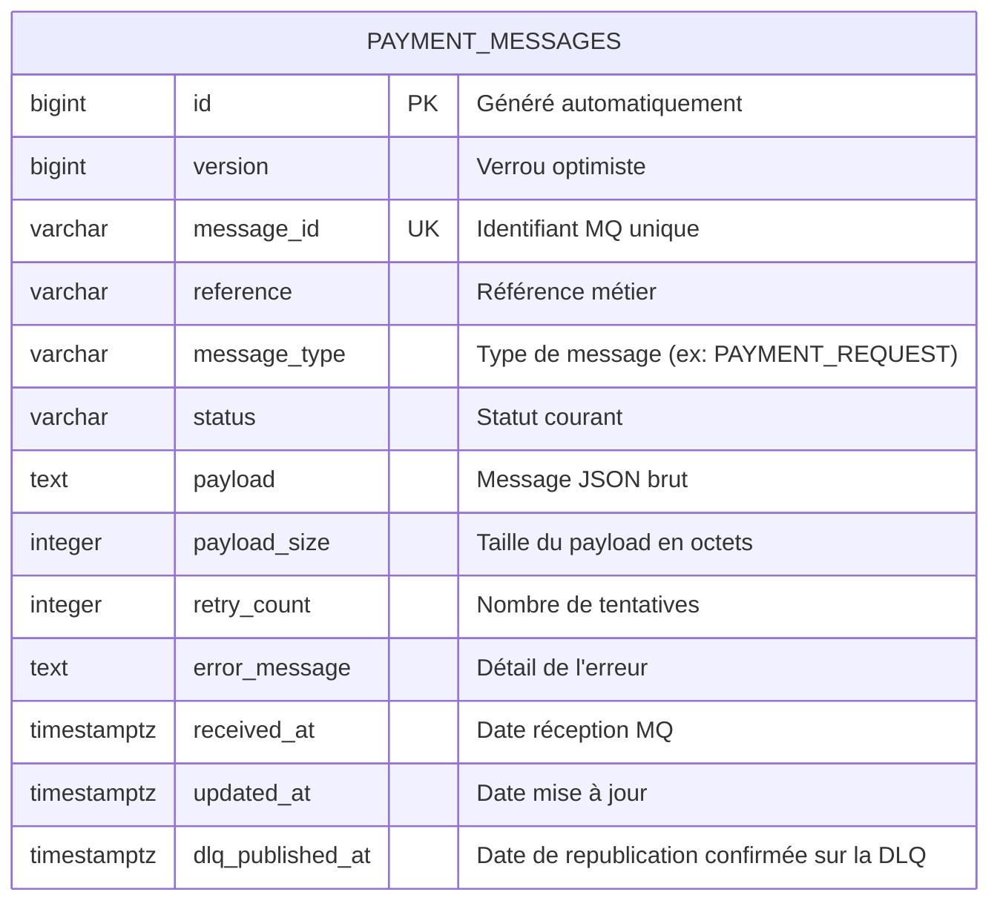

# Modèle de données

## 1. Schéma entité-relation


```mermaid
erDiagram
    PAYMENT_MESSAGES {
        bigint id PK "Généré automatiquement"
        bigint version "Verrou optimiste"
        varchar message_id UK "Identifiant MQ unique"
        varchar reference "Référence métier"
        varchar message_type "Type de message (ex: PAYMENT_REQUEST)"
        varchar status "Statut courant"
        text payload "Message JSON brut"
        integer payload_size "Taille du payload en octets"
        integer retry_count "Nombre de tentatives"
        text error_message "Détail de l'erreur"
        timestamptz received_at "Date réception MQ"
        timestamptz updated_at "Date mise à jour"
        timestamptz dlq_published_at "Date de republication confirmée sur la DLQ"
    }
```

## 2. Table `payment_messages`

### 2.1 Colonnes

| Colonne | Type | Contraintes | Description |
|---|---|---|---|
| `id` | `BIGINT` | `PK`, `GENERATED BY DEFAULT AS IDENTITY` | Identifiant technique auto-généré |
| `version` | `BIGINT` | nullable | Verrou optimiste (`@Version`) : deux mises à jour concurrentes ne peuvent plus s'écraser, la seconde échoue en `409` |
| `message_id` | `VARCHAR(255)` | `NOT NULL`, `UNIQUE` | Identifiant unique du message MQ |
| `reference` | `VARCHAR(255)` | `NOT NULL`, indexé | Référence métier du paiement |
| `message_type` | `VARCHAR(255)` | nullable | Type de message (ex: `PAYMENT_REQUEST`) |
| `status` | `VARCHAR(255)` | `NOT NULL` | Statut du cycle de vie |
| `payload` | `TEXT` | nullable | Contenu JSON brut du message MQ ; **jamais renvoyé par les listes**, seulement par `GET /messages/{id}` |
| `payload_size` | `INTEGER` | nullable | Taille du payload en octets, calculée à l'ingestion : évite de transporter le payload pour afficher sa taille |
| `retry_count` | `INTEGER` | `NOT NULL DEFAULT 0` | Nombre de tentatives de reprise |
| `error_message` | `TEXT` | nullable | Message d'erreur détaillé |
| `received_at` | `TIMESTAMPTZ` | nullable | Date et heure de réception depuis MQ (avec fuseau) |
| `updated_at` | `TIMESTAMPTZ` | nullable | Date et heure de dernière mise à jour |
| `dlq_published_at` | `TIMESTAMPTZ` | nullable | Republication confirmée sur la DLQ ; `NULL` sur un `DEAD_LETTER` signale une divergence base / broker, reprise par `DeadLetterRecoveryJob` |

### 2.2 Index

| Nom | Colonne(s) | Type | Sert |
|---|---|---|---|
| `idx_pm_reference` | `reference` | B-tree | recherche par référence métier |
| `idx_pm_received_at` | `received_at DESC` | B-tree | tri par défaut de la liste |
| `idx_pm_status_received_at` | `status, received_at DESC` | B-tree | filtre par statut seul **et** filtre + tri (évite le seq scan + tri complet) |
| `idx_pm_status_dlq_published_at` | `status, dlq_published_at` | B-tree | reprise DLQ (`DeadLetterRecoveryJob`) |

### 2.3 Contraintes

- `UK_message_id` : unicité sur `message_id`
- `FK` : aucune (table autonome)

---

## 3. Enum `PaymentMessageStatus`

Stockée en tant que `VARCHAR` en base via `@Enumerated(STRING)`.

| Valeur | Signification |
|---|---|
| `RECEIVED` | Message consommé de la file MQ et persisté, en attente de traitement |
| `PROCESSED` | Traitement terminé avec succès (terminal) |
| `FAILED` | Erreur technique ou métier, rejouable via `/retry` |
| `DEAD_LETTER` | Abandonné après `ibm.mq.max-retries` tentatives, republié sur la DLQ (terminal) |

---

## 4. Gestion du schéma

Le schéma est piloté par **Flyway** (`backend/src/main/resources/db/migration`), pas par
Hibernate :

```yaml
spring:
  flyway:
    enabled: true
    baseline-on-migrate: true   # bases antérieures à Flyway, créées par ddl-auto: update
    baseline-version: 0         # laisse V1 (idempotente) s'appliquer malgré tout
  jpa:
    hibernate:
      ddl-auto: validate        # Hibernate vérifie l'accord entité / schéma, sans le modifier
```

| Migration | Contenu |
|---|---|
| `V1__baseline_schema.sql` | table `payment_messages` et ses index, en `CREATE … IF NOT EXISTS` |
| `V2__timestamptz_version_payload_size.sql` | colonnes `version` / `payload_size`, passage des horodatages en `TIMESTAMPTZ`, backfill de `payload_size`, renommage de l'index de référence |

Les tests tournent sur H2 avec `spring.flyway.enabled: false` et un schéma généré par
Hibernate : les migrations sont écrites pour PostgreSQL.

### Rétention

`MessageRetentionJob` purge par lots les messages `PROCESSED` au-delà de
`app.retention.processed-days` (90 jours par défaut). **Désactivé par défaut**
(`app.retention.enabled`), la suppression étant irréversible. Sur de très gros volumes,
lui préférer un partitionnement natif par mois sur `received_at`, où l'archivage se fait
par `DETACH PARTITION`.

---

## 5. Requêtes notables

### Compter par statut

```sql
SELECT p.status, COUNT(p)
FROM PaymentMessage p
GROUP BY p.status
```

### Pagination par curseur (keyset)

Ni `COUNT(*)` ni `OFFSET`, donc un coût constant quelle que soit la profondeur ; l'`id`
départage deux messages reçus au même instant.

```sql
SELECT … FROM PaymentMessage p
WHERE (:status IS NULL OR p.status = :status)
  AND (:receivedAfter IS NULL OR p.receivedAt > :receivedAfter)
  AND (:cursorReceivedAt IS NULL
       OR p.receivedAt < :cursorReceivedAt
       OR (p.receivedAt = :cursorReceivedAt AND p.id < :cursorId))
ORDER BY p.receivedAt DESC, p.id DESC
```

### Recherche avec filtres

```sql
-- Par statut
SELECT p FROM PaymentMessage p WHERE p.status = :status

-- Par date de réception
SELECT p FROM PaymentMessage p WHERE p.receivedAt > :receivedAfter

-- Combiné (statut + date)
SELECT p FROM PaymentMessage p
WHERE p.status = :status AND p.receivedAt > :receivedAfter
```
