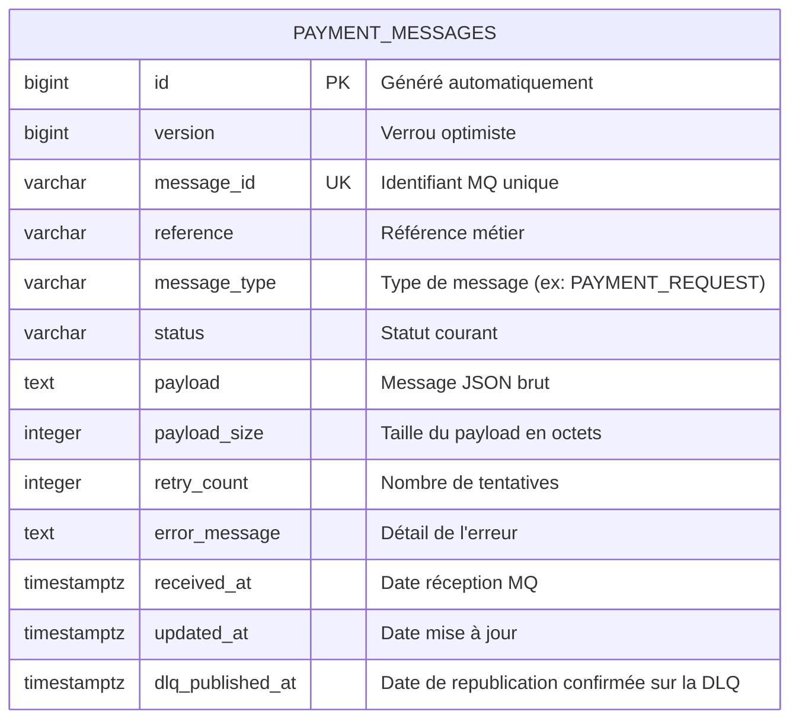

# Modèle de données

## 1. Schéma entité-relation


```mermaid
erDiagram
    PAYMENT_MESSAGES {
        bigint id PK "Généré automatiquement"
        bigint version "Verrou optimiste"
        varchar message_id UK "Identifiant MQ unique"
        varchar reference "Référence métier"
        varchar message_type "Type de message (ex: PAYMENT_REQUEST)"
        varchar status "Statut courant"
        text payload "Message JSON brut"
        integer payload_size "Taille du payload en octets"
        integer retry_count "Nombre de tentatives"
        text error_message "Détail de l'erreur"
        timestamptz received_at "Date réception MQ"
        timestamptz updated_at "Date mise à jour"
        timestamptz dlq_published_at "Date de republication confirmée sur la DLQ"
    }
```

## 2. Table `payment_messages`

### 2.1 Colonnes

| Colonne | Type | Contraintes | Description |
|---|---|---|---|
| `id` | `BIGINT` | `PK`, `GENERATED BY DEFAULT AS IDENTITY` | Identifiant technique auto-généré |
| `version` | `BIGINT` | nullable | Verrou optimiste (`@Version`) : deux mises à jour concurrentes ne peuvent plus s'écraser, la seconde échoue en `409` |
| `message_id` | `VARCHAR(255)` | `NOT NULL`, `UNIQUE` | Identifiant unique du message MQ |
| `reference` | `VARCHAR(255)` | `NOT NULL`, indexé | Référence métier du paiement |
| `message_type` | `VARCHAR(255)` | nullable | Type de message (ex: `PAYMENT_REQUEST`) |
| `status` | `VARCHAR(255)` | `NOT NULL` | Statut du cycle de vie |
| `payload` | `TEXT` | nullable | Contenu JSON brut du message MQ ; **jamais renvoyé par les listes**, seulement par `GET /messages/{id}` |
| `payload_size` | `INTEGER` | nullable | Taille du payload en octets, calculée à l'ingestion : évite de transporter le payload pour afficher sa taille |
| `retry_count` | `INTEGER` | `NOT NULL` | Nombre de tentatives de reprise ; la valeur initiale `0` vient de l'entité (`@Builder.Default`), pas d'un `DEFAULT` SQL |
| `error_message` | `TEXT` | nullable | Message d'erreur détaillé |
| `received_at` | `TIMESTAMPTZ` | nullable | Date et heure de réception depuis MQ (avec fuseau) |
| `updated_at` | `TIMESTAMPTZ` | nullable | Date et heure de dernière mise à jour |
| `dlq_published_at` | `TIMESTAMPTZ` | nullable | Republication confirmée sur la DLQ ; `NULL` sur un `DEAD_LETTER` signale une divergence base / broker, reprise par `DeadLetterRecoveryJob` |

### 2.2 Index

| Nom | Colonne(s) | Type | Sert |
|---|---|---|---|
| `idx_pm_reference` | `reference` | B-tree | recherche par référence métier |
| `idx_pm_received_at` | `received_at DESC` | B-tree | tri par défaut de la liste |
| `idx_pm_status_received_at` | `status, received_at DESC` | B-tree | filtre par statut seul **et** filtre + tri (évite le seq scan + tri complet) |
| `idx_pm_status_dlq_published_at` | `status, dlq_published_at` | B-tree | reprise DLQ (`DeadLetterRecoveryJob`) |
| `idx_pm_message_type` | `message_type` | B-tree | filtre par type (serveur) et `SELECT DISTINCT message_type` du sélecteur de filtres |

La recherche texte (`?q=`) compare `lower(reference)`, `lower(message_id)` et
`lower(message_type)` à un motif `%fragment%` : aucun index B-tree ne peut la servir. Sur de
gros volumes, la doter d'un index trigramme (`pg_trgm` + GIN) est l'étape suivante — non
faite ici, l'extension n'étant pas garantie disponible et H2 ne sachant pas l'exprimer.

### 2.3 Contraintes

- `UK_message_id` : unicité sur `message_id` — c'est **elle** qui porte l'idempotence de
  l'ingestion, pas le contrôle d'existence préalable (cf.
  [flux.md §3](../architecture/flux.md#3-ingestion-mq)) ;
- `FK` : aucune (table autonome).

> **Les `VARCHAR(255)` sont recopiés dans le contrat d'entrée.** `messageId`, `messageType` et
> `reference` portent un `@Size(max = 255)` dans `dto/mq/PaymentMessageEvent`, et
> `PaymentMessageMapper.toFailedEntity` tronque à la même longueur. Sans cette symétrie, une
> valeur trop longue passe la validation puis casse à l'`INSERT` : la violation d'intégrité est
> alors indiscernable d'une panne, donc traitée comme transitoire, donc redélivrée en boucle.
> **Élargir ou réduire une de ces colonnes impose de bouger la contrainte du contrat avec elle.**

---

## 3. Enum `PaymentMessageStatus`

Stockée en tant que `VARCHAR` en base via `@Enumerated(STRING)`.

| Valeur | Signification |
|---|---|
| `RECEIVED` | Message consommé de la file MQ et persisté, en attente de traitement |
| `PROCESSED` | Traitement terminé avec succès (terminal) |
| `FAILED` | Erreur technique ou métier, rejouable via `/retry` |
| `DEAD_LETTER` | Abandonné après `ibm.mq.max-retries` tentatives, republié sur la DLQ (terminal) |

---

## 4. Gestion du schéma

Le schéma est **dérivé des entités par Hibernate**. Il n'y a pas d'outil de migration : la
seule définition de la table et de ses index est `entity/PaymentMessage` (annotations
`@Table(indexes = …)`, `@Column`).

```yaml
spring:
  jpa:
    hibernate:
      ddl-auto: ${JPA_DDL_AUTO:update}   # crée ce qui manque au démarrage
```

| Valeur de `JPA_DDL_AUTO` | Effet |
|---|---|
| `update` (défaut) | crée les tables, colonnes et index absents ; ne supprime ni ne modifie l'existant |
| `validate` | vérifie l'accord entité / schéma et refuse de démarrer en cas d'écart — à utiliser là où le schéma est posé en amont |
| `create-drop` | recrée le schéma à chaque contexte ; c'est ce qu'utilisent les tests unitaires sur H2 |

Deux conséquences à connaître :

- **`update` ne fait qu'ajouter.** Renommer une colonne, changer un type ou retirer une
  contrainte n'est pas propagé : sur une base existante, l'opération est à passer à la main.
- **Les index déclarés dans l'entité sont les index réels.** Retirer une annotation
  `@Index` sur une base déjà créée ne supprime pas l'index côté PostgreSQL.

Les tests unitaires tournent sur H2 (`create-drop`), les `*IT` sur un vrai PostgreSQL
(Testcontainers, `update`) : c'est là que les types effectivement générés — `timestamptz`
en particulier — sont confrontés au moteur cible.

### Rétention

`MessageRetentionJob` purge par lots les messages `PROCESSED` au-delà de
`app.retention.processed-days` (90 jours par défaut). **Désactivé par défaut**
(`app.retention.enabled`), la suppression étant irréversible. Sur de très gros volumes,
lui préférer un partitionnement natif par mois sur `received_at`, où l'archivage se fait
par `DETACH PARTITION`.

---

## 5. Requêtes notables

### Compter par statut

```sql
SELECT p.status, COUNT(p)
FROM PaymentMessage p
GROUP BY p.status
```

### Pagination par curseur (keyset)

Ni `COUNT(*)` ni `OFFSET`, donc un coût constant quelle que soit la profondeur ; l'`id`
départage deux messages reçus au même instant.

```sql
SELECT … FROM PaymentMessage p
WHERE (:status IS NULL OR p.status = :status)
  AND (:receivedAfter IS NULL OR p.receivedAt > :receivedAfter)
  AND (:cursorReceivedAt IS NULL
       OR p.receivedAt < :cursorReceivedAt
       OR (p.receivedAt = :cursorReceivedAt AND p.id < :cursorId))
ORDER BY p.receivedAt DESC, p.id DESC
```

### Recherche avec filtres

Un prédicat unique couvre les seize combinaisons : un paramètre nul neutralise sa clause. Le
groupe de recherche texte est parenthésé — `AND` lie plus fort que `OR`, sans quoi un fragment
recherché annulerait les autres filtres. Le même prédicat sert la liste, son `COUNT(*)` et les
compteurs par statut, ce qui garantit qu'un tableau et ses pastilles parlent des mêmes lignes.

```sql
SELECT … FROM PaymentMessage p
WHERE (:status IS NULL OR p.status = :status)
  AND (:receivedAfter IS NULL OR p.receivedAt > :receivedAfter)
  AND (:type IS NULL OR p.messageType = :type)
  AND (:text IS NULL
       OR lower(p.reference) LIKE :text
       OR lower(p.messageId) LIKE :text
       OR lower(p.messageType) LIKE :text)
```

### Agrégats du tableau de bord

Calculés en SQL, en remplacement d'un échantillon de 200 messages que le client recomptait.
Le volume horaire regroupe sur l'heure extraite de `received_at` ; la fenêtre couvrant 24
heures consécutives alignées sur l'heure pleine, chaque heure du jour n'y apparaît qu'une fois
et le service peut réassocier chaque tranche à son instant absolu. L'heure est extraite dans
le fuseau de la session base de données (celui de la JVM, transmis par le pilote).

```sql
SELECT extract(hour from p.receivedAt), COUNT(p)
FROM PaymentMessage p
WHERE p.receivedAt >= :from
GROUP BY extract(hour from p.receivedAt)
```

Complété par `GROUP BY p.messageType`, `GROUP BY p.retryCount` (regroupé en 0 / 1 / 2 / 3+
côté service), `MAX(p.receivedAt)` et les cinq derniers `FAILED` / `DEAD_LETTER`. L'ensemble
est mis en cache quelques secondes (`STATS_CACHE_TTL`).

---

## 6. Voir aussi

| Sujet | Fichier |
|---|---|
| Dépôt et projections de liste | [`architecture-backend.md`](../architecture/architecture-backend.md) §5.3 |
| Chemins d'ingestion et idempotence | [`flux.md`](../architecture/flux.md#3-ingestion-mq) §3 |
| Contrat de la file d'entrée | [`ibm-mq-configuration.md`](../ibm-mq/ibm-mq-configuration.md) §4.3 |
| Contrat REST exposé | [`api-documentation.md`](../api/api-documentation.md) |
