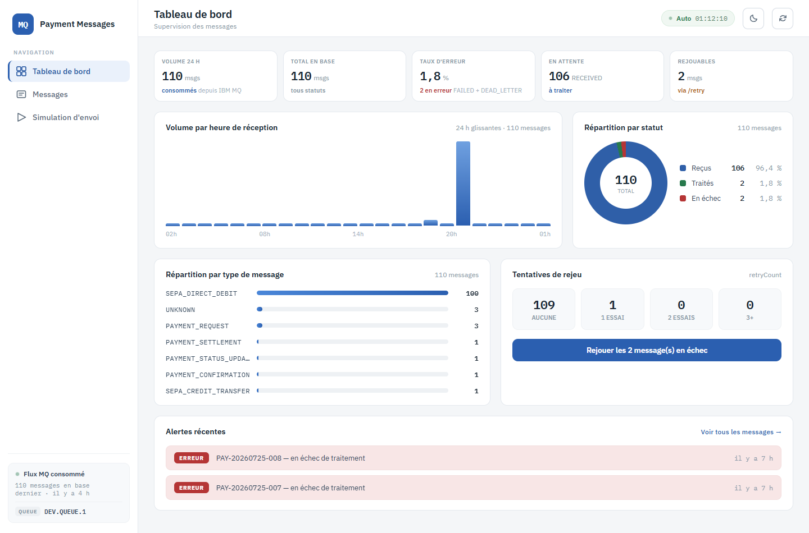

# 1. Tableau de bord

**Route** : `/dashboard` (écran par défaut) · **Objectif** : voir en un coup d'œil l'état du
flux consommé depuis IBM MQ et repérer les messages en échec.

## Les cinq indicateurs du haut

| Indicateur | Ce qu'il compte |
|---|---|
| **Volume 24 h** | Messages reçus sur les 24 dernières heures glissantes |
| **Total en base** | Tous statuts confondus |
| **Taux d'erreur** | Part de `FAILED` + `DEAD_LETTER` sur le total |
| **En attente** | Messages au statut `RECEIVED`, non encore traités |
| **Rejouables** | Messages `FAILED`, candidats à `/retry` |

Les compteurs viennent d'agrégats calculés en base, pas d'un échantillon de la liste : ils
restent exacts quel que soit le volume.

## Volume par heure de réception

Histogramme sur 24 heures glissantes, aligné sur le début d'heure courant. Chaque barre porte
une infobulle `heure · n message(s)`. L'axe rappelle les heures de repère. Quand aucun message
n'est arrivé sur la fenêtre, le bloc affiche « Aucun message reçu sur les 24 dernières heures ».

## Répartition par statut

Anneau + légende chiffrée (nombre et pourcentage) pour les quatre statuts. C'est la même source
que les pastilles de la liste des messages.

## Répartition par type de message

Barres horizontales par `messageType` (`SEPA_CREDIT_TRANSFER`, `PAYMENT_REQUEST`, `UNKNOWN`…),
triées par volume décroissant.

## Tentatives de rejeu

Quatre tuiles regroupant les messages par `retryCount` : aucune, 1 essai, 2 essais, 3 et plus.

Sous les tuiles, le bouton **« Rejouer les N message(s) en échec »** lance un rejeu de masse :

- il est désactivé quand aucun message n'est en `FAILED` ;
- le traitement est asynchrone côté serveur, par lots ; pendant l'exécution le bouton affiche
  « Rejeu en cours… N message(s) » et l'avancement est suivi automatiquement ;
- un seul rejeu de masse peut tourner à la fois.

## Alertes récentes

Les cinq derniers messages en `FAILED` ou `DEAD_LETTER`, avec leur référence et leur ancienneté.
Chaque ligne est un lien direct vers le détail du message ; « Voir tous les messages → » ouvre
la liste complète.

## Chargement progressif

Les blocs situés sous la ligne de flottaison (répartition par type, tentatives de rejeu,
alertes) ne sont rendus qu'à leur entrée dans la fenêtre. Un cadre gris de même hauteur réserve
la place, la page ne saute donc pas au défilement.

---

Suite : [2. Consultation des messages](02-consultation-messages.md)
