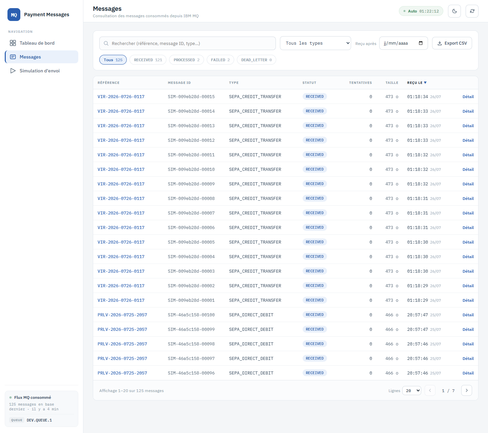
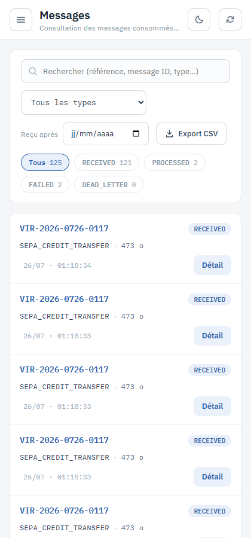

# 2. Consultation des messages

**Route** : `/messages` · **Objectif** : parcourir les messages consommés, les trier, les
paginer, les exporter.

## Structure de l'écran

1. **Barre d'outils** : recherche, type, date, export CSV, réinitialisation (voir
   [3. Recherche et filtres](03-recherche-et-filtres.md)).
2. **Pastilles de statut** : `Tous`, `RECEIVED`, `PROCESSED`, `FAILED`, `DEAD_LETTER`, chacune
   avec son compteur.
3. **Tableau** des messages de la page courante.
4. **Pied de page** : plage affichée, taille de page, navigation entre les pages.

## Colonnes du tableau

| Colonne | Contenu | Triable |
|---|---|:---:|
| Référence | Référence métier du message (`PAY-…`, `VIR-…`, `PRLV-…`) | ✔ |
| Message ID | Identifiant unique du message MQ | ✔ |
| Type | `messageType` du contrat MQ | ✔ |
| Statut | Pastille colorée | ✔ |
| Tentatives | `retryCount`, mis en évidence dès 1 | ✔ |
| Taille | Taille du payload en octets | ✘ |
| Reçu le | Heure puis date de réception | ✔ |

Le **payload n'est jamais chargé dans la liste** : seule sa taille est affichée. Le contenu
complet ne se lit que sur le détail d'un message.

## Trier

Cliquer sur l'en-tête d'une colonne triable. Un premier clic trie en ordre décroissant, un
second bascule en croissant ; une flèche ▲/▼ marque la colonne active. Le tri est effectué par
le serveur et remet la pagination à la première page. Tri par défaut : `Reçu le`, décroissant.

## Paginer

Le pied de page indique « Affichage 1–20 sur N messages ». La liste déroulante **Lignes**
propose 10, 20, 50 ou 100 lignes par page ; les flèches ‹ › passent d'une page à l'autre et
l'indicateur `1 / 7` donne la position.

## Ouvrir un message

- **Clic sur la ligne** (ou sur la référence) : ouvre le **tiroir latéral** de détail, sans
  quitter la liste.
- **Lien « Détail »** en fin de ligne : ouvre la **page complète** du message.

Voir [4. Détail d'un message](04-detail-message.md).

## Exporter en CSV

Le bouton **Export CSV** télécharge **la page actuellement affichée** (pas l'ensemble du
résultat), au format `messages-AAAA-MM-JJ.csv`, séparateur `;`, encodage UTF-8 avec BOM —
directement lisible par Excel. Colonnes exportées : `id`, `reference`, `messageId`,
`messageType`, `status`, `retryCount`, `payloadBytes`, `receivedAt`, `updatedAt`,
`errorMessage`.

## États particuliers

- **Chargement** : un squelette de tableau remplace les lignes ; lors d'un rafraîchissement de
  fond, les lignes existantes restent en place.
- **Aucun résultat** : « Aucun message ne correspond aux filtres ».
- **Échec de chargement** : un bandeau rouge apparaît *au-dessus* du tableau et propose
  **Réessayer**. Les lignes précédentes restent affichées, mais elles ne correspondent alors
  pas forcément aux filtres sélectionnés — c'est exactement ce que dit le bandeau.

## Affichage mobile

Sous 700 px de large, le tableau est remplacé par des cartes empilées : référence, statut,
type, taille, tentatives, horodatage et lien « Détail ».

---

Suite : [3. Recherche et filtres](03-recherche-et-filtres.md)
