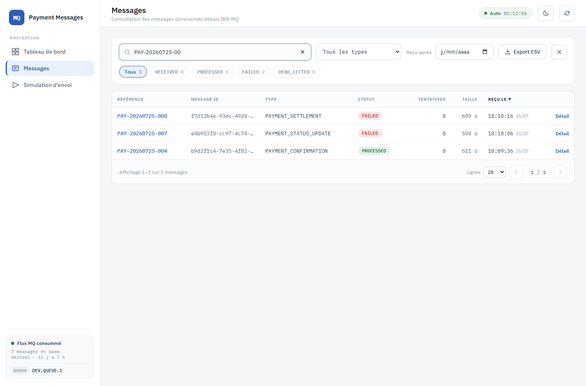
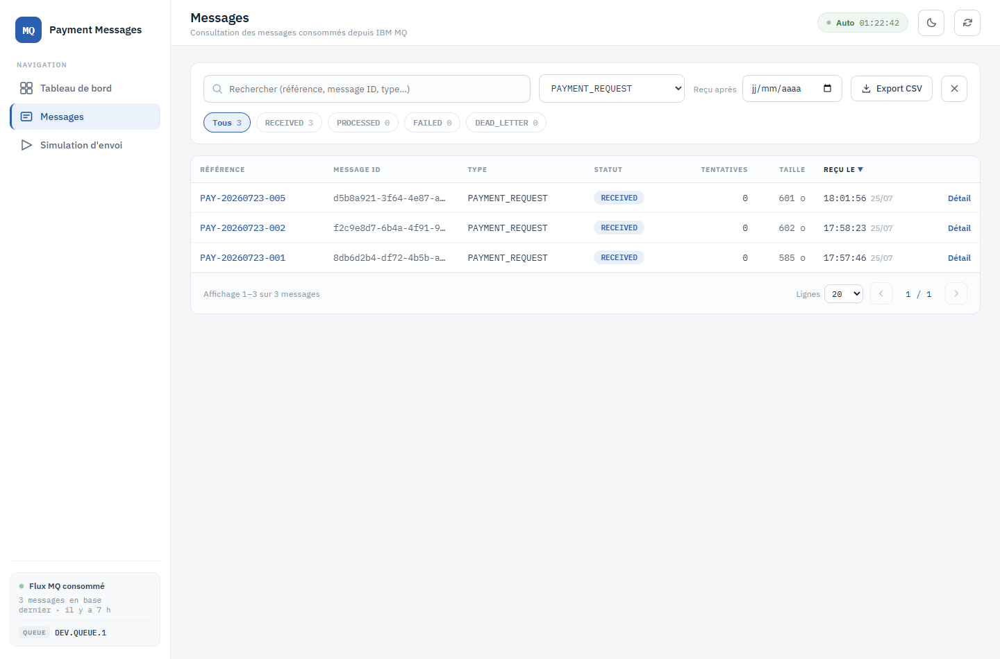
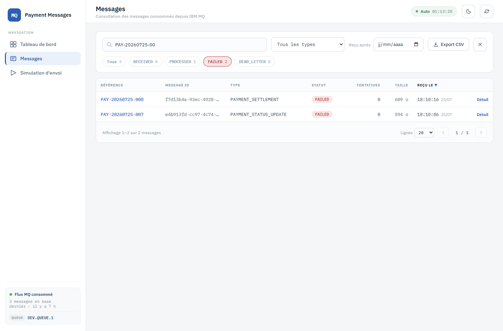

# 3. Recherche et filtres

**Route** : `/messages` · **Objectif** : réduire la liste à ce qu'on cherche, sans jamais
désynchroniser les lignes et les compteurs.

Les **quatre critères sont appliqués par le serveur** et se combinent : recherche libre, type,
date de réception, statut. Les compteurs des pastilles sont recalculés sous les critères
actifs — une pastille annonce donc exactement ce que donnerait un clic dessus.

## Recherche libre

Le champ de gauche cherche dans la **référence**, le **message ID** et le **type**. La saisie
est temporisée (250 ms) : une requête par saisie, pas une par frappe.

Ici « PAY-20260725-00 » ramène 3 messages, et les pastilles suivent : `Tous 3`, `PROCESSED 1`,
`FAILED 2`.

## Filtrer par type

La liste déroulante **Tous les types** est alimentée par les types réellement présents en base.

## Filtrer par statut

Cliquer sur une pastille restreint la liste à ce statut ; recliquer sur `Tous` l'enlève.

Le statut sélectionné est le **seul critère reporté dans l'URL** (`/messages?status=FAILED`) :
un rechargement, un favori ou un retour arrière retrouvent la liste filtrée. Le type, la date et
la recherche libre restent en mémoire de page — la recherche libre n'a pas vocation à circuler
dans un lien partagé.

## Filtrer par date de réception

Le champ **Reçu après** ne garde que les messages reçus à partir de la date choisie (bornes
incluses au début de journée).

## Réinitialiser

Dès qu'un critère est actif, une croix apparaît à droite de la barre d'outils : elle remet les
quatre critères à zéro en une fois.

## Points de comportement utiles

- Changer un critère **repart de la page 1**.
- Il n'y a **aucun filtrage côté navigateur** : ce que montre le tableau et ce que comptent les
  pastilles viennent de la même requête serveur.
- Le nombre affiché sur `Tous` est le total **sous les autres critères actifs**, pas le total de
  la base.

---

Suite : [4. Détail d'un message](04-detail-message.md)
