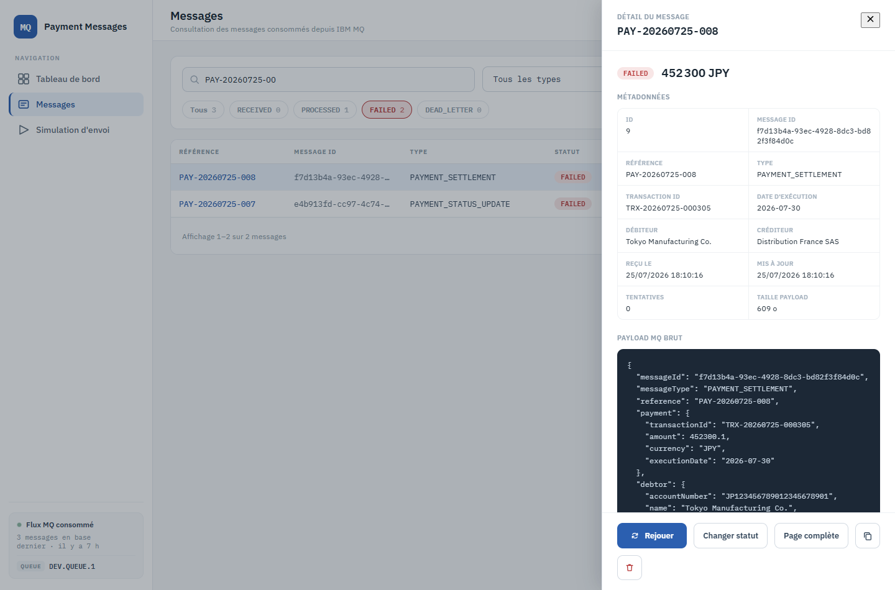
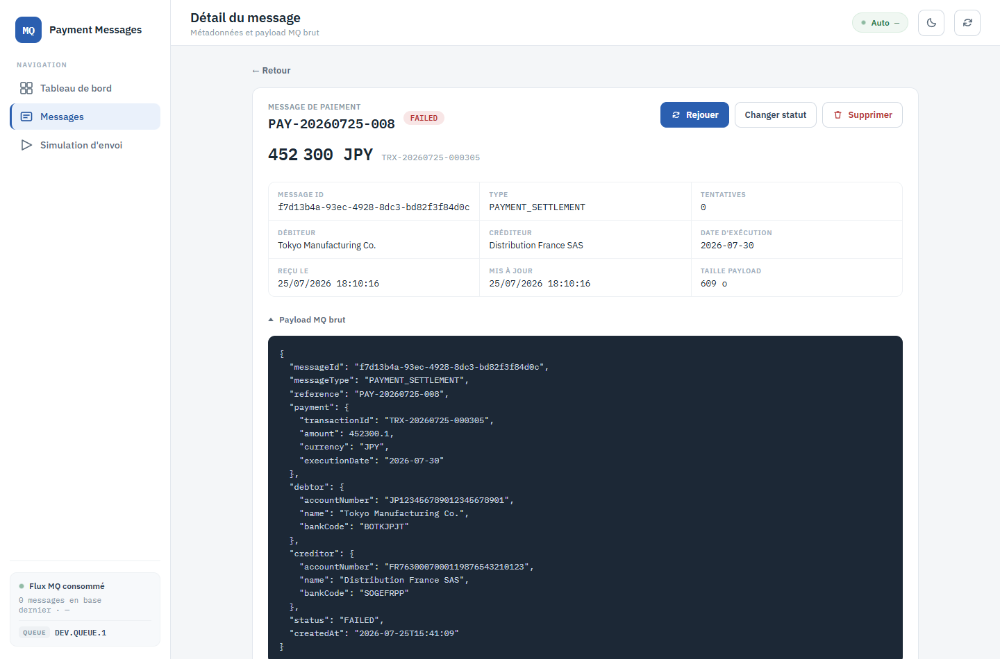

# 4. Détail d'un message

**Routes** : tiroir latéral depuis `/messages`, ou page complète `/messages/:id` ·
**Objectif** : lire les métadonnées et le payload MQ brut d'un message.

Deux présentations pour le même contenu :

| | Tiroir | Page complète |
|---|---|---|
| Ouverture | clic sur une ligne de la liste | lien « Détail » de la ligne, ou bouton « Page complète » du tiroir |
| Contexte | la liste reste visible derrière | écran dédié, adressable et partageable |

## Tiroir latéral

De haut en bas :

- **Référence** du message et bouton de fermeture ;
- **statut** et **montant** du paiement ;
- le **message d'erreur** en encart rouge, si le message est en échec ;
- le bloc **Métadonnées** : `id`, `messageId`, référence, type, `transactionId`, date
  d'exécution, débiteur, créditeur, date de réception, date de mise à jour, nombre de
  tentatives, taille du payload ;
- le **payload MQ brut**, reformaté. Si le JSON est illisible, il est affiché tel quel avec la
  mention « JSON illisible, affiché tel quel » — c'est le texte réellement reçu sur la file.

En pied de tiroir : **Rejouer**, **Changer statut**, **Page complète**, copier le payload,
supprimer. Voir [5. Actions sur un message](05-actions-sur-un-message.md).

Un clic hors du tiroir ou sur la croix le referme.

## Page complète

Même contenu, mise en page dédiée : en-tête avec référence, statut et les trois actions
(**Rejouer**, **Changer statut**, **Supprimer**), montant et `transactionId`, grille de
métadonnées, puis un bloc **Payload MQ brut** repliable — replié par défaut, déplié au clic.

Le lien **← Retour** ramène à la liste.

## Champs affichés vs champs déduits

- Les métadonnées techniques (identifiants, statut, tentatives, horodatages, taille) viennent
  de la base.
- Les données de paiement (montant, devise, débiteur, créditeur, date d'exécution) sont lues
  dans le payload : elles n'apparaissent donc que sur les vues de détail, jamais dans la liste.

---

Suite : [5. Actions sur un message](05-actions-sur-un-message.md)
