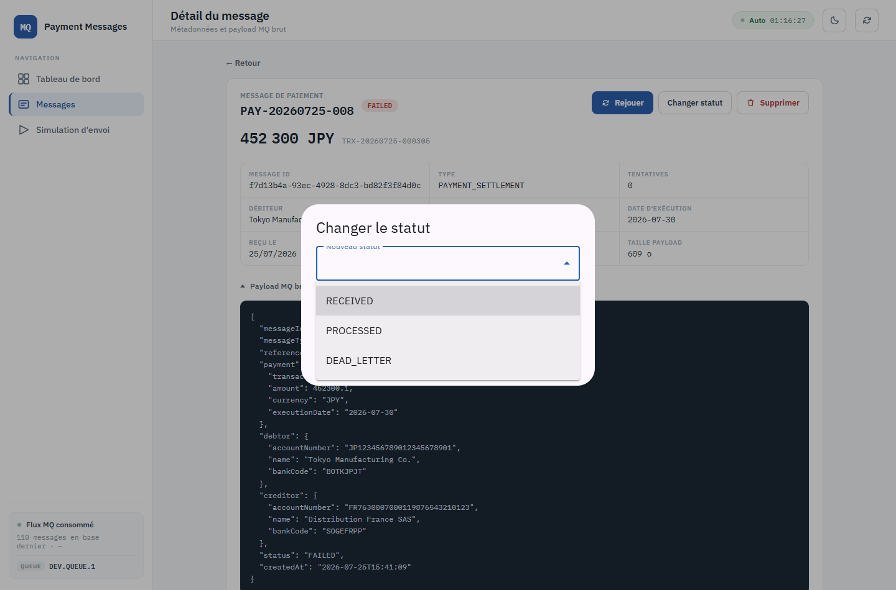
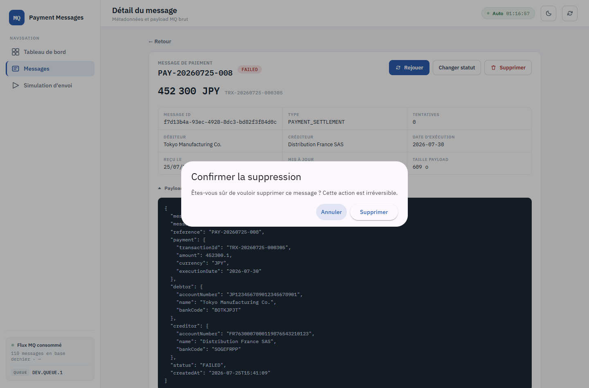

# 5. Actions sur un message

**Depuis** : le tiroir de la liste ou la page `/messages/:id` · **Objectif** : reprendre un
message en échec, corriger son statut, ou le retirer de la base.

Trois actions unitaires — **Rejouer**, **Changer statut**, **Supprimer** — plus le rejeu de
masse depuis le tableau de bord.

## Rejouer un message

Le bouton **Rejouer** n'est actif que sur un message au statut `FAILED` : c'est le seul état
depuis lequel une reprise a un sens.

Le rejeu remet le message en `RECEIVED` et incrémente son compteur de tentatives. Au-delà du
plafond configuré côté serveur (`ibm.mq.max-retries`), le message passe en `DEAD_LETTER` et est
publié sur la file de rebut ; il n'est alors plus rejouable.

Retour visuel : un bandeau « Message relancé », la ligne concernée clignote brièvement dans la
liste, et les compteurs sont recalculés.

## Rejouer tous les messages en échec

Depuis le [tableau de bord](01-tableau-de-bord.md), bouton **« Rejouer les N message(s) en
échec »**. Le traitement est asynchrone et progresse par lots bornés : le bouton affiche
l'avancement, puis un bandeau final « N message(s) relancé(s) ». Si le plafond d'un run est
atteint, le message précise « plafond atteint, relancer pour poursuivre ».

## Changer le statut

La liste déroulante ne propose **que les statuts atteignables depuis l'état courant** :

| Statut courant | Cibles proposées |
|---|---|
| `RECEIVED` | `PROCESSED`, `FAILED` |
| `FAILED` | `RECEIVED`, `PROCESSED`, `DEAD_LETTER` |
| `PROCESSED` | *aucune — statut terminal* |
| `DEAD_LETTER` | *aucune — statut terminal* |

Sur un statut terminal, la boîte de dialogue l'annonce et ne propose rien.

Le champ **Motif** est facultatif (500 caractères max) et sert à tracer l'intervention — par
exemple « rejeu après correction du référentiel ». Il est conservé comme message d'erreur quand
la cible est un état d'échec.

**Confirmer** applique le changement ; **Annuler** ferme sans rien faire. Si le serveur refuse
la transition, le message d'erreur qu'il renvoie est affiché tel quel.

## Supprimer un message

La suppression demande une confirmation explicite — **elle est irréversible**, la ligne est
retirée de la base et le payload avec elle.

Depuis la page complète, la suppression renvoie sur la liste. Depuis le tiroir, la liste reste
affichée et la ligne disparaît.

## Copier le payload

Dans le tiroir, l'icône de copie place le payload MQ brut dans le presse-papiers — pratique
pour le rejouer depuis l'écran de [simulation](06-simulation-envoi.md) après correction.

---

Suite : [6. Simulation d'envoi](06-simulation-envoi.md)
