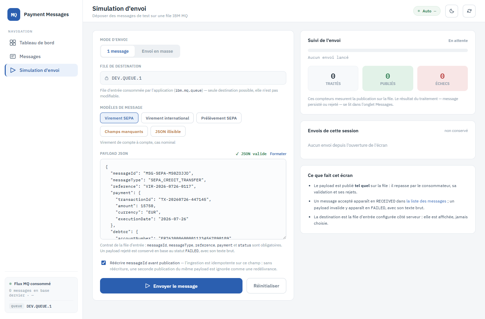
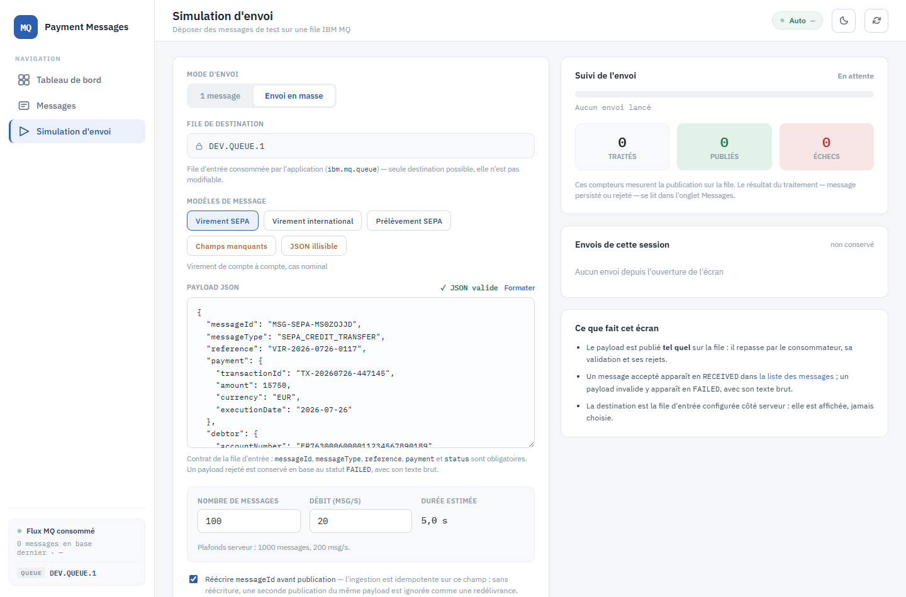
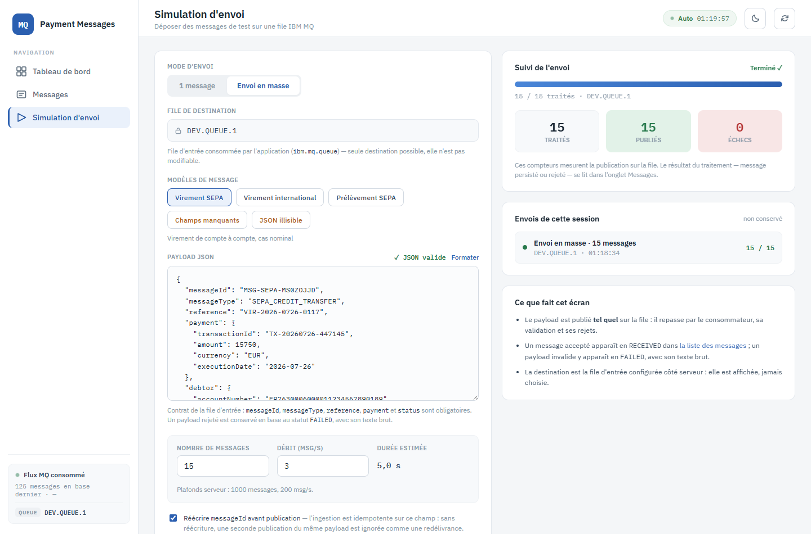

# 6. Simulation d'envoi

**Route** : `/simulation` · **Objectif** : déposer des messages de test sur la file d'entrée
IBM MQ, dans le rôle que tiennent les applications de back-office du flux réel.

## Ce que fait vraiment cet écran

Rien n'est court-circuité. Le payload est publié **tel quel** sur la file ; il revient par le
consommateur, avec la même désérialisation, la même validation et les mêmes rejets qu'un
message venu d'une vraie application. Conséquences directes :

- un payload valide apparaît en `RECEIVED` dans [la liste des messages](02-consultation-messages.md) ;
- un payload invalide y apparaît en `FAILED`, avec son texte brut conservé ;
- **aucune écriture directe en base** n'est faite par cet écran.

Sur un environnement où la file porte un vrai flux, l'écran se coupe par configuration
(`app.simulation.enabled`) : un bandeau l'annonce et l'envoi est refusé.

## Le formulaire

### Mode d'envoi

- **1 message** : un seul dépôt.
- **Envoi en masse** : N messages à un débit donné.

### File de destination

Champ **en lecture seule**. L'API ne prend pas de destination en paramètre : elle publie sur la
file d'entrée que l'application consomme (`ibm.mq.queue`, ici `DEV.QUEUE.1`). Elle est affichée
pour information, jamais choisie.

### Modèles de message

Cinq modèles préremplissent l'éditeur :

| Modèle | Contenu | Résultat attendu |
|---|---|---|
| Virement SEPA | Virement de compte à compte, cas nominal | `RECEIVED` |
| Virement international | SWIFT MT103, devise étrangère, montant élevé | `RECEIVED` |
| Prélèvement SEPA | Petit montant, flux de masse | `RECEIVED` |
| **Champs manquants** | JSON lisible mais incomplet | `FAILED` (rejet à la validation) |
| **JSON illisible** | Payload non désérialisable | `FAILED` (rejet à la lecture) |

Les deux derniers sont **invalides à dessein** : ils couvrent les deux chemins de rejet
définitif du consommateur. L'interface les signale avant l'envoi, mais laisse envoyer — c'est
tout l'intérêt.

### Payload JSON

Éditeur libre. Un indicateur `✓ JSON valide` / `✗ JSON invalide` et un bouton **Formater**
accompagnent la saisie ; la validité n'est qu'indicative, un payload illisible reste envoyable.

Le contrat de la file d'entrée exige `messageId`, `messageType`, `reference`, `payment` et
`status`. Attention aux deux pièges de format, qui diffèrent de l'API REST :
`payment.executionDate` est une date simple (`AAAA-MM-JJ`) et `createdAt` un horodatage **sans
décalage horaire**.

### Réécrire `messageId` avant publication

Case cochée par défaut. L'ingestion est **idempotente sur `messageId`** : sans réécriture, une
seconde publication du même payload est ignorée comme une redélivrance, et un envoi en masse ne
produirait qu'une seule ligne en base.

La réécriture n'a lieu que si le payload s'analyse comme un objet JSON — un payload illisible
part intact, sinon il ne testerait plus rien.

## Envoi en masse

Deux champs : **Nombre de messages** et **Débit (msg/s)**, avec la **durée estimée** calculée en
regard. Les plafonds serveur sont rappelés sous les champs (ici 1000 messages, 200 msg/s) et
proviennent de la configuration — l'interface ne les invente pas et le serveur refuse de toute
façon ce qui les dépasse.

Un seul envoi peut être en vol à la fois.

## Suivi de l'envoi

Le panneau de droite montre l'avancement (`15 / 15 traités`, file de destination) et trois
compteurs : **traités**, **publiés**, **échecs**. Ces compteurs mesurent la **publication sur la
file** — le résultat du traitement (message persisté ou rejeté) se lit dans l'onglet Messages.

En dessous, **Envois de cette session** garde la trace des envois lancés depuis l'ouverture de
l'écran. Cet historique est en mémoire de page : il disparaît au rechargement, rien n'est
persisté.

## Vérifier le résultat

Après un envoi, ouvrir [la liste des messages](02-consultation-messages.md) : les messages
publiés y apparaissent, triés par date de réception décroissante. Un envoi issu d'un modèle
invalide se retrouve en filtrant sur la pastille `FAILED`.

---

Suite : [7. Préférences d'interface](07-preferences-interface.md)
