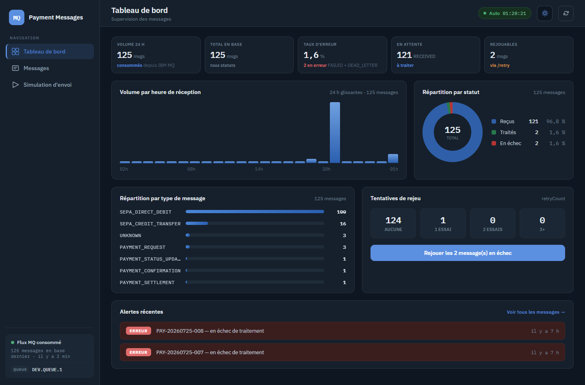

# 7. Préférences d'interface

Trois contrôles, présents dans l'en-tête de tous les écrans, à droite du titre.

## Rafraîchissement automatique

La pastille **Auto** affiche l'heure du dernier chargement. Cliquer dessus suspend le
rafraîchissement : la pastille passe en **Figé**, son point cesse de battre et l'heure reste
celle du dernier chargement réel.

- Période : 30 secondes.
- Le rafraîchissement ne tourne que lorsque l'onglet est **visible** — revenir sur l'onglet
  déclenche une mise à jour immédiate.
- Seules les vues effectivement ouvertes sont rechargées, avec les mêmes critères que la
  dernière requête ; les squelettes de chargement ne réapparaissent pas.

Le bouton **Actualiser** (icône de rotation) force un rechargement immédiat, que le
rafraîchissement automatique soit actif ou non.

## Thème clair / sombre

Le bouton lune/soleil bascule le thème. Le choix est mémorisé dans le navigateur et
réappliqué à la visite suivante ; sans choix explicite, l'application suit la préférence du
système.

## Affichage réduit

Sous 900 px, l'en-tête laisse place à un bouton menu qui ouvre le bandeau de navigation, et la
pastille Auto est masquée. Sous 700 px, les tableaux deviennent des cartes — voir
[2. Consultation des messages](02-consultation-messages.md).

## Robustesse réseau

Ces comportements ne se règlent pas, mais expliquent ce qu'on observe :

- toute requête est abandonnée au bout de **15 secondes** ;
- les **lectures** (chargement d'une liste, d'un détail, des statistiques) sont retentées
  automatiquement deux fois en cas de coupure ou d'erreur serveur ;
- les **commandes** (rejeu, changement de statut, suppression, envoi de simulation) ne sont
  **jamais** rejouées automatiquement — les redéclencher doublerait l'effet métier ;
- lorsqu'une nouvelle requête de liste part, la précédente est annulée : c'est le dernier
  critère demandé qui gagne, pas la réponse la plus rapide.

---

Retour à l'[index du guide](README.md).
